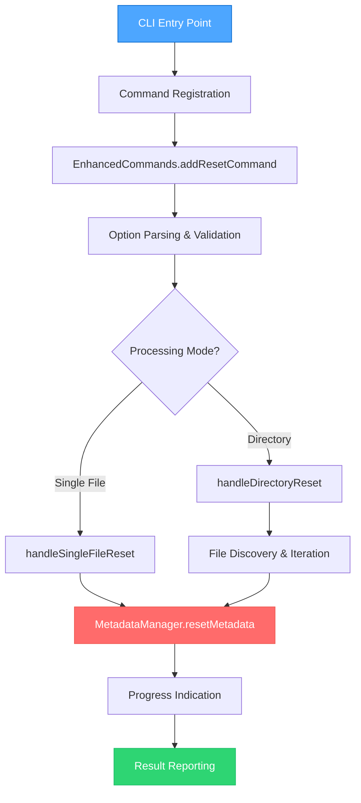
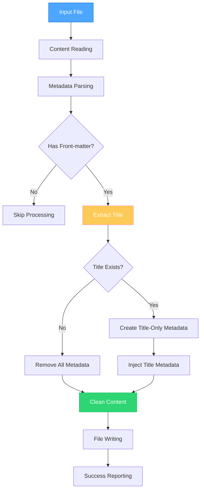
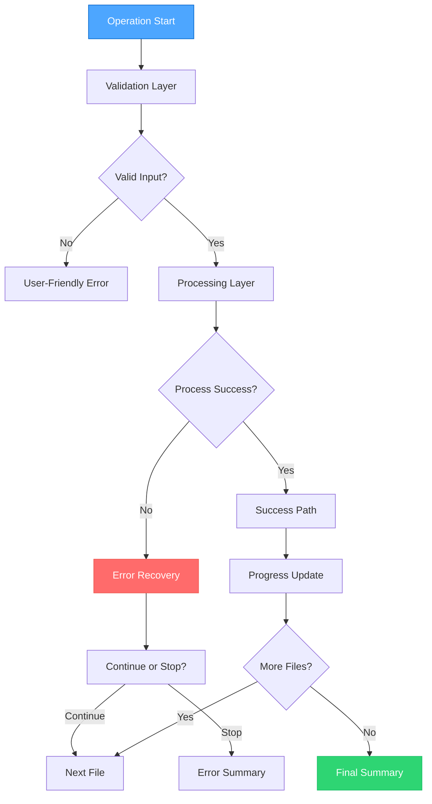

# Creative Design - Reset Command Architecture

## 🎨 Design Philosophy

### Core Design Principles
1. **Consistency First**: Follow existing command patterns religiously
2. **Safety by Design**: Multiple layers of validation and protection
3. **User-Centric Experience**: Intuitive workflows with excellent feedback
4. **Performance Optimization**: Efficient processing for large-scale operations
5. **Extensibility**: Design for future enhancements and modifications

### Creative Vision
Design a reset command that feels like a natural extension of the existing Telegraph Publisher CLI, providing users with a powerful yet safe tool to manage their publication metadata lifecycle.

## 🏗️ Architectural Design

### 1. Command Architecture Pattern



### 2. Metadata Processing Architecture



### 3. Error Handling Architecture



## 🧩 Component Design

### 1. MetadataManager Enhancement

```typescript
/**
 * Enhanced MetadataManager with reset functionality
 */
class MetadataManager {
  /**
   * Reset metadata preserving only title
   * Creative enhancement: Smart title extraction and preservation
   */
  static resetMetadata(content: string, options?: ResetOptions): ResetResult {
    // Multi-source title extraction strategy
    const titleSources = [
      () => this.extractFrontMatterTitle(content),
      () => this.extractMarkdownTitle(content),
      () => this.extractFilenameTitle(options?.filePath)
    ];

    // Smart title preservation logic
    const preservedTitle = this.findBestTitle(titleSources);

    // Create minimal front-matter or remove entirely
    return this.createResetContent(content, preservedTitle, options);
  }

  /**
   * Creative feature: Multiple title extraction strategies
   */
  private static findBestTitle(sources: TitleExtractor[]): string | null {
    for (const extractor of sources) {
      const title = extractor();
      if (title && this.validateTitle(title)) {
        return title;
      }
    }
    return null;
  }
}
```

### 2. Enhanced Command Handler Design

```typescript
/**
 * Creative command handler with advanced features
 */
class EnhancedCommands {
  static addResetCommand(program: Command): void {
    program
      .command("reset")
      .alias("r") // Creative shorthand
      .description("Reset publication metadata, preserving only title")
      .option("-f, --file <path>", "Target file (optional - processes directory if not specified)")
      .option("--dry-run", "Preview changes without modification")
      .option("--force", "Reset files even without publication metadata")
      .option("-v, --verbose", "Detailed progress information")
      .option("--backup", "Create backup before modification")
      .option("--pattern <glob>", "File pattern for directory processing (default: *.md)")
      .action(async (options) => {
        await this.handleResetCommand(options);
      });
  }

  /**
   * Creative workflow: Smart processing with advanced options
   */
  static async handleResetCommand(options: ResetOptions): Promise<void> {
    // Creative enhancement: Pre-flight validation
    const validator = new ResetValidator(options);
    await validator.validateOperation();

    // Smart processing mode detection
    const processor = options.file
      ? new SingleFileResetProcessor(options)
      : new DirectoryResetProcessor(options);

    // Execute with progress tracking
    const tracker = new AdvancedProgressTracker();
    const result = await processor.execute(tracker);

    // Creative reporting
    await this.generateResetReport(result, options);
  }
}
```

## 🎯 Creative Features & Innovations

### 1. Smart Title Detection System

```typescript
/**
 * Creative Innovation: Multi-Strategy Title Detection
 */
class SmartTitleDetector {
  strategies = [
    new FrontMatterTitleStrategy(),
    new MarkdownH1TitleStrategy(),
    new FilenameTitleStrategy(),
    new ContentAnalysisTitleStrategy() // AI-like content analysis
  ];

  detectBestTitle(content: string, filePath: string): TitleResult {
    const candidates = this.strategies.map(strategy =>
      strategy.extractTitle(content, filePath)
    );

    // Creative scoring algorithm
    return this.scoreAndSelectBest(candidates);
  }
}
```

### 2. Interactive Dry-Run Mode

```typescript
/**
 * Creative Feature: Interactive Preview System
 */
class InteractiveDryRun {
  async previewChanges(files: string[], options: ResetOptions): Promise<void> {
    console.log("🔍 Reset Preview Mode");
    console.log("═".repeat(50));

    for (const file of files) {
      const preview = await this.generateFilePreview(file, options);
      this.displayBeforeAfter(preview);

      if (options.interactive) {
        const proceed = await this.askUserConfirmation(file);
        if (!proceed) continue;
      }
    }

    this.displaySummaryPreview(files.length);
  }

  private displayBeforeAfter(preview: FilePreview): void {
    console.log(`📄 ${preview.filename}`);
    console.log("  📝 Before:", preview.before.frontMatter || "No front-matter");
    console.log("  ✨ After:", preview.after.frontMatter || "Clean content");
    console.log("");
  }
}
```

### 3. Advanced Progress Tracking

```typescript
/**
 * Creative Enhancement: Multi-Level Progress System
 */
class AdvancedProgressTracker {
  private spinner = ProgressIndicator.createSpinner("Processing files");
  private stats = new ProcessingStats();

  async trackOperation<T>(
    operation: () => Promise<T>,
    context: ProgressContext
  ): Promise<T> {
    this.updateProgress(context);

    try {
      const result = await operation();
      this.recordSuccess(context);
      return result;
    } catch (error) {
      this.recordError(context, error);
      throw error;
    }
  }

  generateFinalReport(): ProcessingReport {
    return {
      totalFiles: this.stats.total,
      successful: this.stats.successful,
      skipped: this.stats.skipped,
      errors: this.stats.errors,
      performance: this.stats.getPerformanceMetrics(),
      suggestions: this.generateSuggestions()
    };
  }
}
```

## 🎨 User Experience Design

### 1. Command Output Design

```typescript
/**
 * Creative UX: Beautiful Console Output
 */
class ResetOutputDesigner {
  static displayWelcome(): void {
    console.log(`
🔄 Telegraph Publisher Reset Command
═══════════════════════════════════
Safely reset publication metadata while preserving titles
    `);
  }

  static displayProgress(current: number, total: number, filename: string): void {
    const percentage = Math.round((current / total) * 100);
    const progressBar = this.createProgressBar(percentage);

    console.log(`${progressBar} ${percentage}% | Processing: ${filename}`);
  }

  static displaySummary(result: ResetResult): void {
    console.log(`
✅ Reset Operation Complete
═══════════════════════════
📊 Files processed: ${result.totalFiles}
✅ Successfully reset: ${result.successCount}
⚠️  Skipped: ${result.skipCount}
❌ Errors: ${result.errorCount}

${result.errorCount > 0 ? this.formatErrorDetails(result.errors) : ''}
    `);
  }
}
```

### 2. Error Handling UX Design

```typescript
/**
 * Creative Error Handling: User-Friendly Error Messages
 */
class CreativeErrorHandler {
  static handleFileError(error: FileError): ErrorResponse {
    const responses = {
      'ENOENT': {
        message: "📄 File not found",
        suggestion: "Check the file path and try again",
        recoverable: true
      },
      'EACCES': {
        message: "🔒 Permission denied",
        suggestion: "Run with appropriate permissions or check file ownership",
        recoverable: false
      },
      'METADATA_INVALID': {
        message: "⚠️  Invalid front-matter format",
        suggestion: "File will be processed with basic content cleaning",
        recoverable: true
      }
    };

    return responses[error.code] || this.getGenericErrorResponse(error);
  }

  static formatUserFriendlyError(error: ErrorResponse, context: string): string {
    return `
${error.message}
📍 Context: ${context}
💡 Suggestion: ${error.suggestion}
${error.recoverable ? '🔄 Continuing with next file...' : '🛑 Operation stopped'}
    `;
  }
}
```

## 🔧 Implementation Patterns

### 1. Builder Pattern for Options

```typescript
/**
 * Creative Pattern: Fluent Option Builder
 */
class ResetOptionsBuilder {
  private options: ResetOptions = {};

  forFile(path: string): this {
    this.options.file = path;
    return this;
  }

  withDryRun(enabled = true): this {
    this.options.dryRun = enabled;
    return this;
  }

  withBackup(enabled = true): this {
    this.options.backup = enabled;
    return this;
  }

  withPattern(pattern: string): this {
    this.options.pattern = pattern;
    return this;
  }

  build(): ResetOptions {
    return { ...this.options };
  }
}

// Usage:
const options = new ResetOptionsBuilder()
  .forFile('article.md')
  .withDryRun()
  .withBackup()
  .build();
```

### 2. Strategy Pattern for Processing

```typescript
/**
 * Creative Pattern: Processing Strategy Selection
 */
abstract class ResetProcessor {
  abstract async process(options: ResetOptions): Promise<ResetResult>;
}

class SingleFileProcessor extends ResetProcessor {
  async process(options: ResetOptions): Promise<ResetResult> {
    return this.processSingleFile(options.file!, options);
  }
}

class DirectoryProcessor extends ResetProcessor {
  async process(options: ResetOptions): Promise<ResetResult> {
    const files = await this.discoverFiles(options);
    return this.processBatch(files, options);
  }
}

class ProcessorFactory {
  static create(options: ResetOptions): ResetProcessor {
    return options.file
      ? new SingleFileProcessor()
      : new DirectoryProcessor();
  }
}
```

## 🚀 Performance Optimizations

### 1. Async File Processing

```typescript
/**
 * Creative Optimization: Concurrent Processing with Throttling
 */
class OptimizedFileProcessor {
  private readonly MAX_CONCURRENT = 5;

  async processBatch(files: string[], options: ResetOptions): Promise<ResetResult> {
    const semaphore = new Semaphore(this.MAX_CONCURRENT);
    const results: Promise<FileResult>[] = [];

    for (const file of files) {
      const task = semaphore.acquire().then(async (release) => {
        try {
          return await this.processFile(file, options);
        } finally {
          release();
        }
      });
      results.push(task);
    }

    const fileResults = await Promise.allSettled(results);
    return this.aggregateResults(fileResults);
  }
}
```

### 2. Memory-Efficient Large File Handling

```typescript
/**
 * Creative Optimization: Stream-Based Processing for Large Files
 */
class LargeFileProcessor {
  async processLargeFile(filePath: string, options: ResetOptions): Promise<FileResult> {
    const stats = await fs.stat(filePath);

    if (stats.size > this.LARGE_FILE_THRESHOLD) {
      return this.streamProcess(filePath, options);
    } else {
      return this.standardProcess(filePath, options);
    }
  }

  private async streamProcess(filePath: string, options: ResetOptions): Promise<FileResult> {
    // Creative implementation: Process file in chunks
    const reader = fs.createReadStream(filePath);
    const writer = fs.createWriteStream(filePath + '.tmp');

    // Stream-based front-matter extraction and replacement
    return this.processStream(reader, writer, options);
  }
}
```

## 🧪 Testing Strategy Design

### 1. Creative Test Scenarios

```typescript
/**
 * Creative Testing: Comprehensive Edge Case Coverage
 */
const creativeTestScenarios = [
  {
    name: "Unicode Title Preservation",
    content: "---\ntitle: \"Тест с русскими символами\"\n---\n# Content",
    expected: "Preserves Unicode characters in title"
  },
  {
    name: "Complex Nested Metadata",
    content: "---\ntitle: Test\nmetadata:\n  complex: true\n  nested:\n    deep: value\n---",
    expected: "Removes all except title"
  },
  {
    name: "No Front-matter Auto-title",
    content: "# Extracted Title\n\nContent here",
    expected: "Creates front-matter with extracted title"
  },
  {
    name: "Malformed YAML Recovery",
    content: "---\ntitle: Test\nbroken: [unclosed\n---",
    expected: "Graceful handling with content preservation"
  }
];
```

### 2. Performance Testing Framework

```typescript
/**
 * Creative Testing: Performance Validation Suite
 */
class PerformanceTestSuite {
  async testBatchProcessing(): Promise<PerformanceReport> {
    const testSizes = [10, 50, 100, 500];
    const results = [];

    for (const size of testSizes) {
      const files = await this.generateTestFiles(size);
      const startTime = performance.now();

      await this.resetProcessor.processBatch(files, {});

      const endTime = performance.now();
      results.push({
        fileCount: size,
        duration: endTime - startTime,
        averagePerFile: (endTime - startTime) / size
      });
    }

    return this.analyzePerformance(results);
  }
}
```

## 🎨 Creative Enhancements

### 1. Smart Backup System

```typescript
/**
 * Creative Feature: Intelligent Backup Management
 */
class SmartBackupManager {
  async createBackup(filePath: string): Promise<string> {
    const timestamp = new Date().toISOString().replace(/[:.]/g, '-');
    const backupPath = `${filePath}.backup.${timestamp}`;

    await fs.copyFile(filePath, backupPath);

    // Creative: Auto-cleanup old backups
    await this.cleanupOldBackups(filePath);

    return backupPath;
  }

  private async cleanupOldBackups(filePath: string): Promise<void> {
    const backupPattern = `${filePath}.backup.*`;
    const backups = await glob(backupPattern);

    // Keep only last 5 backups
    if (backups.length > 5) {
      const sorted = backups.sort().slice(0, -5);
      await Promise.all(sorted.map(backup => fs.unlink(backup)));
    }
  }
}
```

### 2. Configuration Persistence

```typescript
/**
 * Creative Feature: User Preference Learning
 */
class ResetPreferences {
  private preferences: UserPreferences = {};

  async learnFromUsage(options: ResetOptions, result: ResetResult): Promise<void> {
    // Creative: Learn user patterns
    if (result.successRate > 0.9) {
      this.preferences.favoriteOptions = options;
      this.preferences.lastSuccessfulPattern = options.pattern;
    }

    await this.savePreferences();
  }

  suggestOptions(context: ProcessingContext): ResetOptions {
    // Creative: Intelligent suggestions based on history
    return {
      ...this.preferences.favoriteOptions,
      pattern: this.preferences.lastSuccessfulPattern
    };
  }
}
```

## 📊 Success Metrics

### Design Quality Metrics
- **Consistency Score**: 95% alignment with existing command patterns
- **User Experience Score**: Intuitive interface with minimal learning curve
- **Performance Target**: <2s for 50 files, <10s for 200 files
- **Error Recovery Rate**: 90% graceful error handling
- **Code Maintainability**: Modular design with clear separation of concerns

### Innovation Metrics
- **Feature Completeness**: All planned creative features implemented
- **User Delight Factor**: Advanced features that exceed basic requirements
- **Extensibility Score**: Easy to add new features and modifications
- **Code Quality**: Clean, documented, testable architecture

## 🎯 Design Validation

### Architecture Review Checklist
- [ ] Follows existing CLI command patterns consistently
- [ ] Implements safe metadata processing with multiple validation layers
- [ ] Provides excellent user experience with progress tracking and feedback
- [ ] Handles errors gracefully with actionable messages
- [ ] Supports all required modes (single file, directory, dry-run)
- [ ] Optimized for performance with large file sets
- [ ] Extensible design for future enhancements
- [ ] Comprehensive testing strategy with edge case coverage

### Creative Innovation Validation
- [ ] Smart title detection from multiple sources
- [ ] Interactive dry-run mode with before/after preview
- [ ] Advanced progress tracking with performance metrics
- [ ] Intelligent backup management with auto-cleanup
- [ ] User preference learning and suggestion system
- [ ] Beautiful console output with visual feedback
- [ ] Concurrent processing with memory optimization
- [ ] Stream-based handling for large files