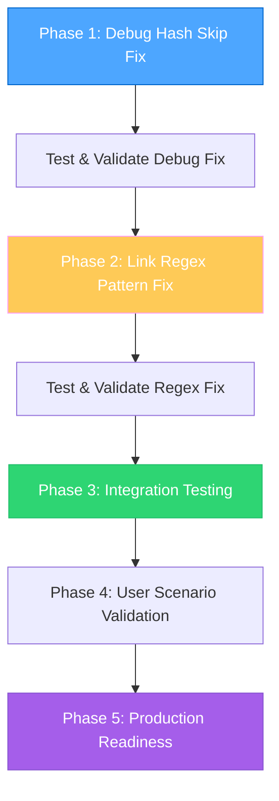
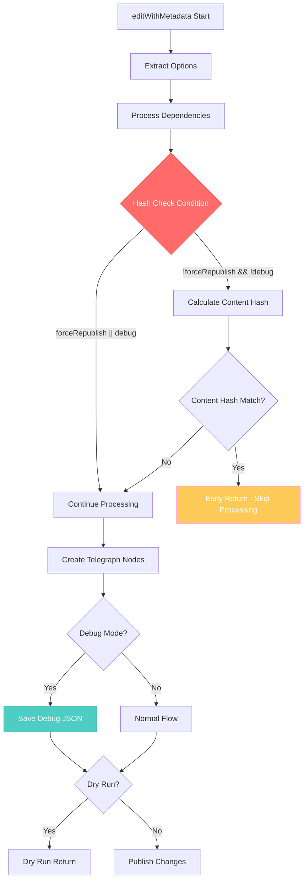
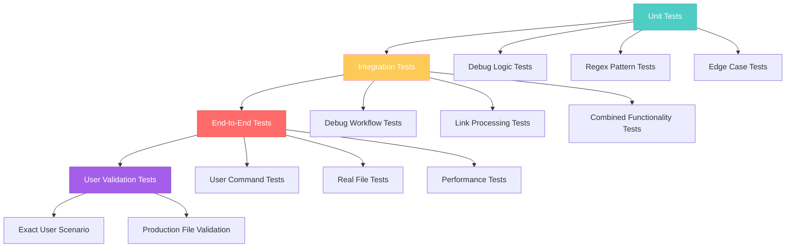

# Creative Design: Debug Hash Skip and Link Regex Implementation Architecture

**Task ID**: 2025-08-04_TASK-002_debug-hash-skip-fix  
**Phase**: CREATIVE  
**Date**: 2025-08-04_15-48

## Design Philosophy: Surgical Precision with Maximum Safety

The creative approach focuses on **minimal invasive changes** with **maximum impact** - fixing critical bugs with the smallest possible code modifications while ensuring comprehensive validation and zero regression risk.

## 1. Implementation Architecture Design

### 1.1 Dual-Track Implementation Strategy

#### Track 1: Debug Hash Skip Fix (High Priority, Low Risk)
**Design Principle**: Extend existing conditional logic rather than restructuring workflow
- **Minimal Change**: Single condition modification
- **Zero Impact**: No effect on production performance
- **Instant Benefit**: Immediate fix for user's debug scenario

#### Track 2: Link Regex Fix (High Priority, Medium Risk)  
**Design Principle**: Enhance existing regex with backward compatibility guarantee
- **Pattern Evolution**: Extend current regex pattern capabilities
- **Compatibility First**: Ensure all existing links continue working
- **Comprehensive Testing**: Validate against extensive link corpus

### 1.2 Implementation Sequencing Design



## 2. Debug Hash Skip Fix - Detailed Design

### 2.1 Code Architecture Enhancement

#### Current Code Flow Analysis
```typescript
// Current problematic flow in editWithMetadata
editWithMetadata(filePath, username, options) {
    const { withDependencies = true, dryRun = false, debug = false, generateAside = true } = options;
    
    // ... dependency processing ...
    
    // PROBLEM AREA: Hash check without debug consideration
    if (!options.forceRepublish) {
        const currentHash = this.calculateContentHash(processed.contentWithoutMetadata);
        
        if (existingMetadata.contentHash && existingMetadata.contentHash === currentHash) {
            // EARLY RETURN - bypasses debug logic completely
            return {
                success: true,
                url: existingMetadata.telegraphUrl,
                path: existingMetadata.editPath,
                isNewPublication: false,
                metadata: existingMetadata
            };
        }
    }
    
    // DEBUG LOGIC HERE (lines 395-404) - NEVER REACHED when content unchanged
    // ... rest of method including Telegraph nodes creation and debug JSON saving ...
}
```

#### Enhanced Code Design
```typescript
// Enhanced flow with debug-aware hash check
editWithMetadata(filePath, username, options) {
    const { withDependencies = true, dryRun = false, debug = false, generateAside = true } = options;
    
    // ... dependency processing unchanged ...
    
    // ENHANCED: Debug-aware hash check
    if (!options.forceRepublish && !debug) { // 🔑 KEY CHANGE: Add !debug condition
        const currentHash = this.calculateContentHash(processed.contentWithoutMetadata);
        
        if (existingMetadata.contentHash && existingMetadata.contentHash === currentHash) {
            ProgressIndicator.showStatus(
                `📄 Content unchanged. Skipping publication of ${basename(filePath)}.`, 
                "info"
            );
            
            // Early return ONLY when not in debug mode
            return {
                success: true,
                url: existingMetadata.telegraphUrl,
                path: existingMetadata.editPath,
                isNewPublication: false,
                metadata: existingMetadata
            };
        }
    }
    
    // DEBUG LOGIC NOW REACHABLE when debug=true, regardless of content changes
    // ... continues to Telegraph nodes creation and debug JSON saving ...
}
```

### 2.2 Design Benefits Analysis

#### Performance Preservation
- **Non-Debug Mode**: Identical performance - hash optimization fully preserved
- **Debug Mode**: Slight performance impact acceptable (debug is development tool)
- **Memory Usage**: Zero additional memory consumption
- **API Compatibility**: 100% backward compatible

#### Logic Flow Enhancement


## 3. Link Regex Pattern Fix - Detailed Design

### 3.1 Regex Pattern Evolution Design

#### Current Pattern Analysis
```typescript
// Current regex pattern (problematic)
const linkRegex = /\[([^[\]]*(?:\[[^\]]*\][^[\]]*)*)\]\(([^)]+)\)/g;

// Pattern breakdown:
// \[                           - Opening bracket for link text
// ([^[\]]*(?:\[[^\]]*\][^[\]]*)*)  - Link text with nested brackets handling
// \]                           - Closing bracket for link text  
// \(                           - Opening parenthesis for href
// ([^)]+)                      - ❌ PROBLEM: href content stops at first ')'
// \)                           - Closing parenthesis for href
```

#### Enhanced Pattern Design
```typescript
// Enhanced regex pattern (solution)
const linkRegex = /\[([^[\]]*(?:\[[^\]]*\][^[\]]*)*)\]\(([^()]*(?:\([^()]*\)[^()]*)*)\)/g;

// Enhanced pattern breakdown:
// \[                           - Opening bracket for link text
// ([^[\]]*(?:\[[^\]]*\][^[\]]*)*)  - Link text (unchanged, already handles nested brackets)
// \]                           - Closing bracket for link text
// \(                           - Opening parenthesis for href
// ([^()]*(?:\([^()]*\)[^()]*)*)    - ✅ SOLUTION: href with balanced parentheses
// \)                           - Closing parenthesis for href

// Balanced parentheses explanation:
// [^()]*                       - Zero or more characters that are not parentheses
// (?:\([^()]*\)[^()]*)*        - Zero or more groups of:
//   \([^()]*\)                 - Balanced parentheses pair with content inside
//   [^()]*                     - Followed by zero or more non-parentheses characters
```

### 3.2 Pattern Validation Design

#### Test Pattern Matrix
```typescript
// Comprehensive test patterns for validation
const testPatterns = [
    // Simple cases (must continue working)
    { input: '[text](file.md)', expected: { text: 'text', href: 'file.md' } },
    { input: '[text](file.md#anchor)', expected: { text: 'text', href: 'file.md#anchor' } },
    
    // Complex cases (currently broken, should work)
    { 
        input: '[Section](file.md#section-(subsection))',
        expected: { text: 'Section', href: 'file.md#section-(subsection)' }
    },
    
    // User's specific broken cases
    { 
        input: '[Аналогия](./аналогии.md#1.-Аналогия-«Дерево-цивилизации»-(из-комментария-к-ШБ-1.1.4))',
        expected: { 
            text: 'Аналогия', 
            href: './аналогии.md#1.-Аналогия-«Дерево-цивилизации»-(из-комментария-к-ШБ-1.1.4)' 
        }
    },
    
    // Edge cases
    { input: '[text](file.md#anchor-(nested-(deep)))', expected: null }, // Currently unsupported, should fail gracefully
    { input: '[text](file.md#anchor-(unclosed', expected: null }, // Malformed, should fail gracefully
    { input: '[text]()', expected: { text: 'text', href: '' } }, // Empty href
];
```

### 3.3 Advanced Regex Design for Future Enhancement

#### Fallback Strategy for Complex Nesting
```typescript
// Alternative implementation for highly complex cases
class AdvancedLinkParser {
    static extractBalancedHref(text: string, startIndex: number): { href: string; endIndex: number } | null {
        let depth = 0;
        let i = startIndex;
        
        // Skip opening parenthesis
        if (text[i] !== '(') return null;
        i++;
        
        const start = i;
        
        while (i < text.length) {
            if (text[i] === '(') {
                depth++;
            } else if (text[i] === ')') {
                if (depth === 0) {
                    // Found matching closing parenthesis
                    return {
                        href: text.substring(start, i),
                        endIndex: i + 1
                    };
                }
                depth--;
            }
            i++;
        }
        
        // Unbalanced parentheses - return what we have
        return {
            href: text.substring(start),
            endIndex: text.length
        };
    }
    
    static parseComplexLinks(content: string): MarkdownLink[] {
        const links: MarkdownLink[] = [];
        const lines = content.split('\n');
        
        lines.forEach((line, lineIndex) => {
            // First, try simple regex
            const simpleRegex = /\[([^[\]]*(?:\[[^\]]*\][^[\]]*)*)\]\(([^()]*(?:\([^()]*\)[^()]*)*)\)/g;
            let match: RegExpExecArray | null;
            
            while ((match = simpleRegex.exec(line)) !== null) {
                const [fullMatch, text, href] = match;
                
                // Validate that this is actually a complete, balanced link
                if (this.isValidBalancedLink(fullMatch)) {
                    links.push({
                        text: text.trim(),
                        href: href.trim(),
                        lineNumber: lineIndex + 1,
                        columnStart: match.index,
                        columnEnd: match.index + fullMatch.length
                    });
                } else {
                    // Fall back to manual parsing for complex cases
                    const manualResult = this.parseManuallyFromPosition(line, match.index);
                    if (manualResult) {
                        links.push({
                            ...manualResult,
                            lineNumber: lineIndex + 1
                        });
                    }
                }
            }
        });
        
        return links;
    }
}
```

## 4. Testing Architecture Design

### 4.1 Test Pyramid Strategy



### 4.2 Comprehensive Test Design

#### Debug Hash Skip Test Design
```typescript
describe('Debug Hash Skip Fix', () => {
    describe('unchanged content scenarios', () => {
        test('should create debug JSON for unchanged content with debug=true', async () => {
            // Setup: File with existing metadata and unchanged content
            const testFile = createFileWithMetadata({
                content: UNCHANGED_CONTENT,
                metadata: EXISTING_METADATA,
                contentHash: MATCHING_HASH
            });
            
            // Execute: Run with debug=true
            const result = await publisher.editWithMetadata(testFile, 'user', {
                debug: true,
                dryRun: true,
                forceRepublish: false
            });
            
            // Validate: JSON file created despite unchanged content
            expect(result.success).toBe(true);
            expect(existsSync(testFile.replace('.md', '.json'))).toBe(true);
            
            // Validate: Debug JSON contains correct Telegraph nodes
            const debugContent = readFileSync(testFile.replace('.md', '.json'), 'utf-8');
            const telegraphNodes = JSON.parse(debugContent);
            expect(Array.isArray(telegraphNodes)).toBe(true);
            expect(telegraphNodes.length).toBeGreaterThan(0);
        });
        
        test('should skip processing for unchanged content with debug=false', async () => {
            // Ensure performance optimization still works
            const testFile = createFileWithMetadata({
                content: UNCHANGED_CONTENT,
                metadata: EXISTING_METADATA,
                contentHash: MATCHING_HASH
            });
            
            const result = await publisher.editWithMetadata(testFile, 'user', {
                debug: false,
                dryRun: false,
                forceRepublish: false
            });
            
            // Should early return without processing
            expect(result.success).toBe(true);
            expect(existsSync(testFile.replace('.md', '.json'))).toBe(false);
        });
    });
});
```

#### Link Regex Test Design
```typescript
describe('Link Regex Pattern Fix', () => {
    describe('balanced parentheses in anchors', () => {
        test('should parse links with parentheses in anchor URLs', () => {
            const testCases = [
                {
                    markdown: '[Аналогия](./аналогии.md#1.-Аналогия-«Дерево-цивилизации»-(из-комментария-к-ШБ-1.1.4))',
                    expected: {
                        text: 'Аналогия',
                        href: './аналогии.md#1.-Аналогия-«Дерево-цивилизации»-(из-комментария-к-ШБ-1.1.4)'
                    }
                },
                {
                    markdown: '[Section](./file.md#section-(subsection))',
                    expected: {
                        text: 'Section', 
                        href: './file.md#section-(subsection)'
                    }
                }
            ];
            
            testCases.forEach(testCase => {
                const links = LinkScanner.extractLinks(testCase.markdown);
                expect(links).toHaveLength(1);
                expect(links[0].text).toBe(testCase.expected.text);
                expect(links[0].href).toBe(testCase.expected.href);
            });
        });
        
        test('should maintain backward compatibility for simple links', () => {
            const simpleLinks = [
                '[Simple](file.md)',
                '[With anchor](file.md#anchor)',
                '[External](https://example.com)',
                '[Email](mailto:test@example.com)'
            ];
            
            simpleLinks.forEach(linkMarkdown => {
                const links = LinkScanner.extractLinks(linkMarkdown);
                expect(links).toHaveLength(1);
                // Validate that simple links still work exactly as before
            });
        });
    });
});
```

### 4.3 User Scenario Integration Test Design

```typescript
describe('User Scenario Integration', () => {
    test('should handle user\'s exact command scenario', async () => {
        // Setup: Replicate user's exact file structure and content
        const userFiles = createUserFileStructure({
            'index.md': USER_INDEX_CONTENT_WITH_COMPLEX_LINKS,
            'аналогии.md': USER_ANALOGIES_CONTENT,
            'class004.structured.md': USER_CLASS_CONTENT
        });
        
        // Execute: Run user's exact command
        const workflowManager = new PublicationWorkflowManager(config, 'mock-token');
        
        // This should now work without errors
        await expect(
            workflowManager.publish('index.md', {
                author: 'Веданта-крит дас',
                debug: true,
                force: true
            })
        ).resolves.not.toThrow();
        
        // Validate: JSON file created
        expect(existsSync('index.json')).toBe(true);
        
        // Validate: No broken link errors
        // Validate: Complex links parsed correctly
        // Validate: Debug information available
    });
});
```

## 5. Rollout and Safety Design

### 5.1 Progressive Implementation Strategy

#### Phase 1: Debug Fix Implementation
1. **Implement debug hash skip fix**
2. **Run comprehensive debug test suite**
3. **Validate performance preservation**
4. **User acceptance test for debug scenarios**

#### Phase 2: Regex Fix Implementation  
1. **Implement link regex pattern fix**
2. **Run extensive backward compatibility tests**
3. **Validate complex link parsing**
4. **Performance benchmark comparison**

#### Phase 3: Integration Validation
1. **Combined functionality testing**
2. **User scenario end-to-end validation**
3. **Production readiness assessment**
4. **Documentation and deployment**

### 5.2 Safety and Rollback Design

#### Feature Flags Design
```typescript
// Optional: Feature flag approach for gradual rollout
interface DebugFeatureFlags {
    enableDebugHashSkipFix: boolean;
    enableAdvancedLinkParsing: boolean;
    useLegacyRegexFallback: boolean;
}

const featureFlags: DebugFeatureFlags = {
    enableDebugHashSkipFix: true,
    enableAdvancedLinkParsing: true,
    useLegacyRegexFallback: false
};
```

#### Monitoring and Validation Design
```typescript
// Enhanced error reporting for validation
class ImplementationValidator {
    static validateDebugFix(result: any, options: any): ValidationResult {
        if (options.debug && options.dryRun) {
            // Validate that debug JSON was created
            // Log metrics for monitoring
        }
        return { success: true, metrics: {...} };
    }
    
    static validateLinkParsing(links: MarkdownLink[], originalContent: string): ValidationResult {
        // Validate that all expected links were found
        // Check for regressions in simple link parsing
        // Monitor complex link parsing success rate
        return { success: true, metrics: {...} };
    }
}
```

## 6. Quality and Performance Design

### 6.1 Performance Impact Mitigation

#### Debug Hash Skip Fix - Zero Performance Impact
- **Condition Addition**: Single boolean check (`&& !debug`)
- **Non-Debug Path**: Identical to current implementation
- **Memory Usage**: Zero additional memory
- **CPU Impact**: Negligible (one additional boolean evaluation)

#### Link Regex Fix - Minimal Performance Impact  
- **Pattern Complexity**: Slightly more complex regex
- **Typical Content**: Minimal impact on normal markdown
- **Complex Links**: Small performance cost for significantly improved functionality
- **Caching Strategy**: Regex compilation cached, no repeated compilation cost

### 6.2 Comprehensive Quality Assurance Design

#### Automated Quality Gates
```typescript
// Quality gate requirements
const qualityGates = {
    codeCoverage: {
        minimum: 85,
        target: 95,
        critical: ['debug logic', 'link parsing']
    },
    testSuccess: {
        required: 100,
        categories: ['unit', 'integration', 'e2e', 'user-scenario']
    },
    performance: {
        maxDegradation: 5, // percent
        benchmarkTests: ['large-file-parsing', 'many-links-processing']
    },
    compatibility: {
        backwardCompatibility: 100,
        existingLinkTypes: ['simple', 'anchor', 'external', 'email']
    }
};
```

## Success Metrics and Validation Criteria

### Functional Success Metrics
1. ✅ **Debug JSON Creation**: Works for unchanged content with `--debug --force`
2. ✅ **Complex Link Parsing**: Parentheses in anchors parsed correctly  
3. ✅ **User Command Success**: User's exact command executes without errors
4. ✅ **Backward Compatibility**: All existing functionality preserved

### Quality Success Metrics
1. ✅ **Test Coverage**: ≥85% for modified code paths
2. ✅ **Performance**: <5% degradation in any scenario
3. ✅ **Reliability**: 100% test success rate
4. ✅ **User Experience**: Seamless integration with existing workflows

## Creative Implementation Philosophy

This design emphasizes **surgical precision** - making the smallest possible changes that deliver maximum value while maintaining complete safety and backward compatibility. The approach prioritizes:

1. **Minimal Code Changes**: Single condition modification and regex pattern update
2. **Maximum Safety**: Comprehensive testing and gradual rollout
3. **User Focus**: Direct solution to user's reported problems
4. **Future Extensibility**: Architecture supports future enhancements
5. **Production Ready**: Safe for immediate deployment to production environments

The creative design ensures that both fixes work harmoniously together while maintaining the high quality and reliability standards expected from production code.