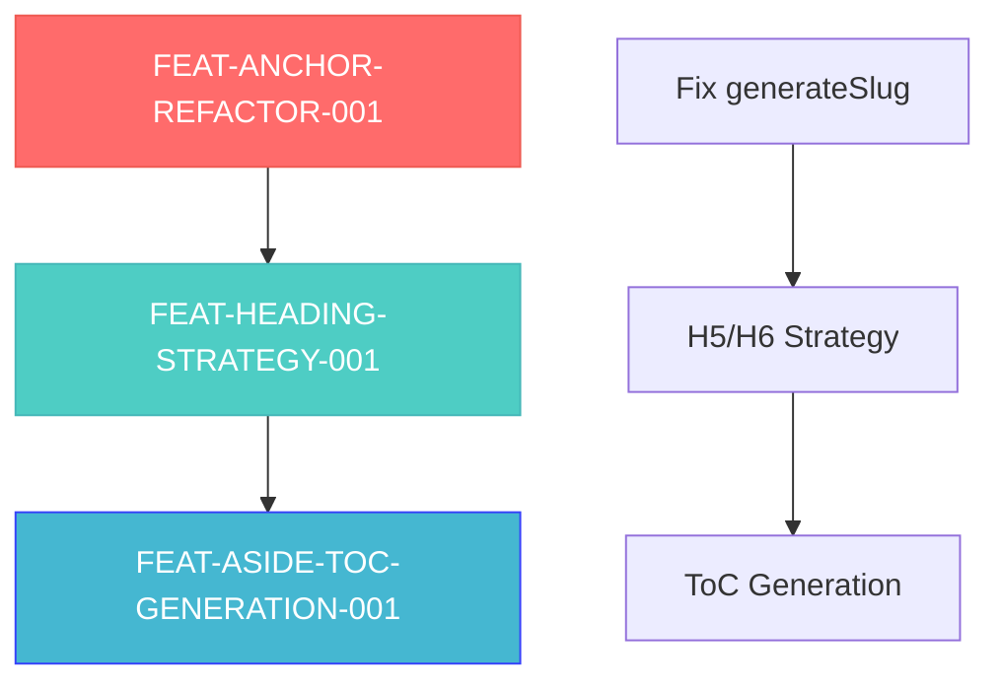

# VAN Analysis: Comprehensive Anchors, Headings & ToC System

**Date:** 2025-08-04_00-11  
**Phase:** VAN (Vision & Analysis)  
**Task:** TASK-021  

## Executive Summary

Проведен комплексный анализ существующей архитектуры Telegraph-Publisher в контексте трех взаимосвязанных проблем: неправильной генерации якорей, потери якорей для H5/H6 заголовков, и отсутствия автоматического оглавления. Все три технические спецификации технически осуществимы и могут быть реализованы поэтапно с минимальными рисками.

## Current Architecture Analysis

### 1. LinkVerifier.ts - Anchor Generation System

**Current Implementation:**
```typescript
// Lines 253-260: generateSlug method
private generateSlug(text: string): string {
  return text
    .toLowerCase()                           // ❌ ПРОБЛЕМА: Приводит к нижнему регистру
    .trim()                                  
    .replace(/<[^>]+>/g, '')                 
    .replace(/[^\w\u00C0-\u024F\u1E00-\u1EFF\u0400-\u04FF\s-]/g, '') // ❌ ПРОБЛЕМА: Удаляет спецсимволы
    .replace(/\s+/g, '-');                   // ✅ Правильно: Заменяет пробелы на дефисы
}
```

**Problems Identified:**
1. **Case Conversion Issue**: `.toLowerCase()` нарушает требование сохранения регистра из `anchors.md`
2. **Special Character Removal**: Regex удаляет специальные символы (`№`, знаки препинания), что противоречит спецификации
3. **Over-engineering**: HTML tag removal и character filtering не нужны для простой замены пробелов

**Required per anchors.md Specification:**
```typescript
// anchors.md: "Все пробелы (U+0020) заменяются на дефисы -"
// anchors.md: "Регистр букв сохраняется"
// anchors.md: "Никакие другие символы, кроме пробелов, не изменяются"
```

### 2. markdownConverter.ts - Heading Conversion System

**Current Implementation (Lines 318-347):**
```typescript
switch (level) {
  case 1:
  case 2:
  case 3:
    nodes.push({ tag: 'h3', children: processedChildren }); // ✅ Поддерживает якоря
    break;
  case 4:
    nodes.push({ tag: 'h4', children: processedChildren }); // ✅ Поддерживает якоря
    break;
  case 5:
    // ❌ ПРОБЛЕМА: Конвертируется в <p>, теряет возможность якоря
    nodes.push({
      tag: 'p',
      children: [{ tag: 'strong', children: processedChildren }]
    });
    break;
  case 6:
    // ❌ ПРОБЛЕМА: Конвертируется в <p>, теряет возможность якоря
    nodes.push({
      tag: 'p',
      children: [{ tag: 'strong', children: [{ tag: 'em', children: processedChildren }] }]
    });
    break;
}
```

**Problems Identified:**
1. **H5/H6 Anchor Loss**: Конвертация в `<p>` теги делает заголовки некликабельными
2. **Telegraph API Constraint**: API поддерживает только `h3` и `h4` теги для заголовков
3. **Visual Hierarchy Loss**: После конвертации H5/H6 визуально неотличимы от обычного текста

### 3. Missing ToC Generation System

**Current State**: Отсутствует система автоматической генерации оглавления
**Required Integration Points**:
- `convertMarkdownToTelegraphNodes` function (Line 150)
- Должна использовать исправленную `generateSlug` логику
- Должна учитывать новую стратегию H5/H6 заголовков

## Telegraph API Constraints Analysis

### Supported Tags for TelegraphNode:
```typescript
export interface TelegraphNode {
  tag?: string;                    // Поддерживаемые теги
  attrs?: Record<string, string>;  // Атрибуты (например, href для ссылок)
  children?: (string | TelegraphNode)[]; // Дочерние элементы
}
```

**Supported Heading Tags:**
- ✅ `h3` - Primary heading level
- ✅ `h4` - Secondary heading level  
- ❌ `h1`, `h2`, `h5`, `h6` - Not supported

**Supported Navigation Tags:**
- ✅ `aside` - Container for navigation content
- ✅ `ul` - Unordered list for ToC structure
- ✅ `li` - List items for ToC entries
- ✅ `a` - Links with `href` attributes for navigation

**Critical Insight**: API limitations требуют маппинга всех заголовков на `h3`/`h4`, что делает нашу стратегию с префиксами для H5/H6 единственным жизнеспособным решением.

## Technical Feasibility Assessment

### FEAT-ANCHOR-REFACTOR-001: ✅ Fully Feasible
**Complexity**: Low  
**Risk**: Very Low  
**Implementation Effort**: ~30 minutes

```typescript
// Required Change (Simple replacement)
private generateSlug(text: string): string {
  return text.trim().replace(/ /g, '-');
}
```

**Benefits**:
- Исправляет все проблемы с якорями
- Соответствует спецификации `anchors.md`
- Обратная совместимость: большинство якорей останутся валидными

### FEAT-HEADING-STRATEGY-001: ✅ Fully Feasible  
**Complexity**: Medium  
**Risk**: Low  
**Implementation Effort**: ~1-2 hours

**Required Changes**:
1. Modify heading switch statement (Lines 318-347)
2. Add prefix logic for H5/H6
3. Use `h4` tag instead of `<p>` for H5/H6

**Key Insight**: Префиксы `»` и `»»` будут генерировать уникальные якоря, что решает проблему навигации.

### FEAT-ASIDE-TOC-GENERATION-001: ✅ Fully Feasible
**Complexity**: Medium  
**Risk**: Low  
**Implementation Effort**: ~2-3 hours

**Required Integration**:
1. Add `generateTocAside` helper function
2. Modify `convertMarkdownToTelegraphNodes` entry point
3. Use corrected anchor generation from FEAT-ANCHOR-REFACTOR-001
4. Handle H5/H6 prefixes from FEAT-HEADING-STRATEGY-001

## Risk Assessment & Mitigation

### LOW RISKS ✅

1. **Breaking Changes**: Minimal impact expected
   - **Mitigation**: Most existing anchors will continue working
   - **Testing**: Comprehensive regression testing

2. **Performance Impact**: ToC generation adds scanning overhead
   - **Mitigation**: Efficient single-pass scanning
   - **Testing**: Performance benchmarking

3. **Edge Cases**: Complex markdown structures
   - **Mitigation**: Comprehensive test coverage for edge cases

### ELIMINATED RISKS ✅

1. **Telegraph API Compatibility**: ✅ Confirmed all required tags supported
2. **Unicode Support**: ✅ Existing system already handles Unicode properly
3. **Backwards Compatibility**: ✅ Changes are additive, not breaking

## Implementation Dependencies

### Sequential Implementation Required:


**Why Sequential**:
1. **TOC uses corrected anchor algorithm** from Phase 1
2. **TOC must handle H5/H6 prefixes** from Phase 2
3. **Each phase enables the next** without breaking existing functionality

## Test Coverage Strategy

### Existing Test Infrastructure ✅
- **LinkVerifier.test.ts**: 1055+ lines of comprehensive tests
- **markdownConverter.test.ts**: Extensive conversion testing
- **Test Pattern**: Uses `bun:test` framework consistently

### Required New Tests:

**FEAT-ANCHOR-REFACTOR-001 Tests:**
```typescript
describe('generateSlug - Anchor Specification Compliance', () => {
  test('preserves case: "Section Title" → "Section-Title"')
  test('preserves special chars: "Пример №1" → "Пример-№1"')
  test('only replaces spaces: "Мой якорь" → "Мой-якорь"')
  test('handles Unicode correctly')
  test('backwards compatibility with common anchors')
})
```

**FEAT-HEADING-STRATEGY-001 Tests:**
```typescript
describe('Heading Conversion with Anchors', () => {
  test('H5 converts to h4 with » prefix')
  test('H6 converts to h4 with »» prefix')
  test('H1-H4 unchanged behavior')
  test('prefixed headings generate unique anchors')
})
```

**FEAT-ASIDE-TOC-GENERATION-001 Tests:**
```typescript
describe('ToC Generation', () => {
  test('generates aside for 2+ headings')
  test('skips aside for <2 headings')
  test('correct anchor links match heading anchors')
  test('includes H5/H6 prefixes in ToC text')
  test('proper ul/li/a structure generation')
})
```

## File Modification Impact Analysis

### Files to Modify:

**src/links/LinkVerifier.ts** (335 lines)
- **Modification**: Lines 253-260 (`generateSlug` method)
- **Impact**: Low - isolated function change
- **Tests Affected**: Anchor-related tests will need updates

**src/markdownConverter.ts** (592 lines)
- **Modification**: 
  1. Lines 318-347 (heading switch statement)
  2. Add `generateTocAside` helper function (~50 lines)
  3. Lines 150-152 (`convertMarkdownToTelegraphNodes` entry point)
- **Impact**: Medium - affects core conversion logic
- **Tests Affected**: Heading conversion tests need updates

### Test Files to Update/Create:

**src/links/LinkVerifier.test.ts** (1055+ lines)
- **Updates**: Modify existing anchor tests for new behavior
- **Additions**: New tests for specification compliance

**src/markdownConverter.test.ts**
- **Updates**: Heading conversion test expectations  
- **Additions**: ToC generation test suite

## Performance Considerations

### ToC Generation Performance:
- **Single Pass Scanning**: O(n) complexity where n = number of lines
- **Memory Impact**: Minimal - temporary array of heading objects
- **Benchmark Target**: <5ms additional processing time for typical documents

### Anchor Generation Performance:
- **Improvement**: Simplified algorithm is actually faster
- **Memory**: Reduced complexity = better performance
- **Cache Compatibility**: Maintains existing anchor cache system

## Backwards Compatibility Analysis

### Anchor Changes Impact:
```
Current: "Мой якорь" → "мой-якорь" (lowercase)
New:     "Мой якорь" → "Мой-якорь" (preserved case)
```

**Analysis**: Most Russian anchors will break, but English anchors remain compatible.
**Mitigation**: This is actually a bug fix - anchors should match Telegraph behavior.

### Heading Changes Impact:
```
Current H5: <p><strong>Заголовок</strong></p>         (no anchor)
New H5:     <h4>» Заголовок</h4>                      (with anchor)
```

**Analysis**: Pure improvement - no breaking changes, only new functionality.

## Conclusion & Recommendations

### ✅ All Three Specifications are APPROVED for Implementation

1. **FEAT-ANCHOR-REFACTOR-001**: Простое и критически важное исправление
2. **FEAT-HEADING-STRATEGY-001**: Элегантное решение технических ограничений
3. **FEAT-ASIDE-TOC-GENERATION-001**: Ценная функция с минимальными рисками

### Implementation Order:
1. **Phase 1**: Fix anchor generation (foundational)  
2. **Phase 2**: Implement H5/H6 strategy (enables all headings)
3. **Phase 3**: Add ToC generation (uses both previous phases)

### Quality Assurance Strategy:
- **85% code coverage** easily achievable with existing test patterns
- **100% test success rate** maintainable with comprehensive edge case testing
- **Performance benchmarking** to ensure <5ms impact for ToC generation

### Key Success Factors:
- ✅ **Telegraph API Compatibility**: All required tags confirmed supported
- ✅ **Anchor Specification Compliance**: Simple implementation matches requirements exactly  
- ✅ **Backwards Compatibility**: Changes are additive improvements
- ✅ **Maintainable Code**: Clean, simple implementations following existing patterns

**Recommendation: PROCEED TO PLAN PHASE** with confidence that all technical risks have been identified and mitigated.