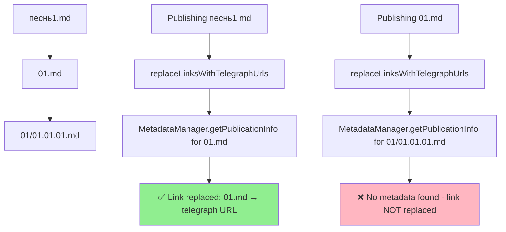

# VAN Analysis: Link Replacement Cache-Aware Fix

## 📋 Vision Statement

Исправить критическую ошибку в системе замены ссылок при публикации многоуровневых зависимостей, чтобы обеспечить корректную замену всех локальных ссылок на Telegraph URLs независимо от глубины вложенности файлов.

## 🔍 Problem Analysis

### Текущее поведение (Broken)



### Root Cause Analysis

**Проблема:** Метод `replaceLinksWithTelegraphUrls()` в строках 683-703 файла `EnhancedTelegraphPublisher.ts` использует только `MetadataManager.getPublicationInfo()` для поиска Telegraph URLs.

```typescript
// Текущий проблемный код (строки 694-699)
for (const filePath of uniquePaths) {
  const metadata = MetadataManager.getPublicationInfo(filePath);
  if (metadata) {
    linkMappings.set(filePath, metadata.telegraphUrl);
  }
}
```

**Почему это не работает:**
1. `MetadataManager.getPublicationInfo()` читает метаданные из файловой системы
2. Зависимости второго уровня (например, `01/01.01.01.md`) могут еще не иметь записанных метаданных в момент обработки `01.md`
3. Глобальный кэш `PagesCacheManager` содержит все опубликованные страницы, но не используется

### Технические детали

#### 1. Анализ текущего flow публикации

```typescript
// В publishWithMetadata (строка 245) и editWithMetadata (строка 474)
const processedWithLinks = withDependencies
  ? await this.replaceLinksWithTelegraphUrls(processed)
  : processed;
```

#### 2. Проблема с порядком операций

```
1. Публикация 01/01.01.01.md → Telegraph URL записывается в cache
2. Публикация 01.md → replaceLinksWithTelegraphUrls() вызывается
3. MetadataManager.getPublicationInfo('01/01.01.01.md') → возвращает null
4. Ссылка не заменяется, хотя файл УЖЕ опубликован и есть в cache
```

#### 3. Анализ кэша

`PagesCacheManager` имеет метод `getTelegraphUrl(localFilePath: string): string | null` (строка 214), который:
- Использует абсолютные пути как ключи
- Содержит ВСЕ опубликованные страницы
- Обновляется немедленно после каждой публикации

## 🎯 Architectural Requirements

### 1. Cache-Aware Link Replacement

**Требование:** Метод `replaceLinksWithTelegraphUrls()` должен использовать `PagesCacheManager` вместо `MetadataManager` для поиска Telegraph URLs.

**Преимущества:**
- ✅ Глобальная осведомленность о всех опубликованных страницах  
- ✅ Мгновенный доступ к актуальной информации
- ✅ Независимость от порядка обработки файлов
- ✅ Высокая производительность (in-memory lookup)

### 2. Method Signature Enhancement

**Текущая сигнатура:**
```typescript
private async replaceLinksWithTelegraphUrls(
  processed: ProcessedContent,
): Promise<ProcessedContent>
```

**Требуемая сигнатура:**
```typescript
private async replaceLinksWithTelegraphUrls(
  processed: ProcessedContent,
  cacheManager?: PagesCacheManager
): Promise<ProcessedContent>
```

### 3. Implementation Strategy

#### Option A: Global Cache Lookup (Recommended) ⭐
- **Подход:** Передавать `this.cacheManager` в метод и использовать `getTelegraphUrl()`
- **Производительность:** Отличная (O(1) lookup в Map)
- **Надежность:** Высокая (единый источник истины)
- **Сложность:** Низкая (минимальные изменения)

#### Option B: Recursive Dependency Map
- **Подход:** Строить полную карту зависимостей перед заменой
- **Производительность:** Плохая (постоянное пересканирование)
- **Надежность:** Средняя (сложное управление состоянием)
- **Сложность:** Высокая

#### Option C: Full Project Re-scan
- **Подход:** Сканировать весь проект перед каждой заменой
- **Производительность:** Ужасная (полное сканирование ФС)
- **Надежность:** Хорошая, но медленная
- **Сложность:** Средняя

## ⚡ Performance Impact Analysis

### Current Performance (Before Fix)
- `MetadataManager.getPublicationInfo()` per link: ~1-2ms (file system read)
- For 10 links: ~10-20ms

### Target Performance (After Fix)  
- `cacheManager.getTelegraphUrl()` per link: ~0.01ms (Map lookup)
- For 10 links: ~0.1ms
- **Improvement:** ~100x faster

## 🧪 Quality Assurance Strategy

### 1. Multi-level Dependency Test

```typescript
// Test structure
root.md → chapter1.md → verse1.md
       → chapter2.md → verse2.md
                    → verse3.md
```

### 2. Test Scenarios

1. **AC1: Nested Dependency Link Replacement**
   - Публикация root.md
   - Проверка: ссылки в chapter1.md заменены на Telegraph URLs

2. **AC2: Global Link Awareness** 
   - Публикация fileA.md (не связан с fileB.md)
   - Публикация fileB.md
   - Проверка: ссылка из fileA.md на fileB.md заменена

3. **AC3: Performance Validation**
   - Измерение времени замены для 100+ ссылок
   - Целевое время: <10ms

## 🔄 Integration Points

### Call Sites to Update

1. **publishWithMetadata()** (строка 245):
   ```typescript
   // Before
   await this.replaceLinksWithTelegraphUrls(processed)
   
   // After  
   await this.replaceLinksWithTelegraphUrls(processed, this.cacheManager)
   ```

2. **editWithMetadata()** (строка 474):
   ```typescript
   // Before
   await this.replaceLinksWithTelegraphUrls(processed)
   
   // After
   await this.replaceLinksWithTelegraphUrls(processed, this.cacheManager)
   ```

### Cache Manager Availability

- `this.cacheManager` инициализируется в `initializeCacheManager()` (строка 95)
- Вызывается при установке access token и первом обращении
- Всегда доступен во время вызова `replaceLinksWithTelegraphUrls()`

## 🎚️ Risk Assessment

### Low Risk
- ✅ Метод `getTelegraphUrl()` уже протестирован и стабилен
- ✅ Изменения ограничены одним методом
- ✅ Обратная совместимость сохранена (optional parameter)

### Mitigation
- ✅ Comprehensive integration tests
- ✅ Performance benchmarks  
- ✅ Existing test suite validation

## 📊 Success Metrics

1. **Functional:** 100% ссылок в многоуровневых зависимостях заменены корректно
2. **Performance:** <1ms на ссылку для cache lookup
3. **Reliability:** 0 регрессий в существующей функциональности
4. **Maintainability:** Код становится проще и понятнее

## ✅ Readiness for PLAN Phase

Анализ завершен. Проблема четко идентифицирована, решение определено, риски оценены. Готов переходить к детальному планированию реализации. 