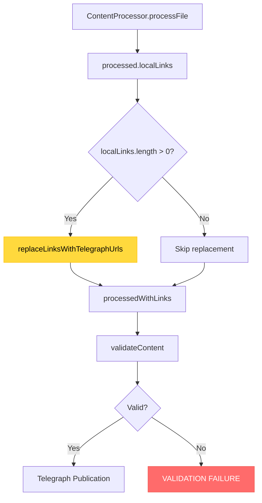

# CREATIVE: Publication Pipeline Link Replacement Fix

**Task ID:** 2025-08-06_TASK-004_publication-pipeline-link-replacement-fix  
**Creative Phase:** 2025-08-06_17-12  
**Phase:** CREATIVE  

📌 CREATIVE PHASE START: Link Replacement Diagnosis & Fix
━━━━━━━━━━━━━━━━━━━━━━━━━━━━━━━

## 1️⃣ PROBLEM ARCHITECTURE ANALYSIS

### **Current System Flow (BROKEN)**


### **Root Cause Hypothesis Matrix**
| Component | Potential Issue | Evidence | Probability |
|-----------|----------------|----------|-------------|
| **ContentProcessor.processFile** | localLinks array empty | JSON shows local links exist | 🟡 Medium |
| **replaceLinksWithTelegraphUrls** | Method not executing | Links remain unchanged | 🔴 High |
| **PagesCacheManager** | Empty/corrupt cache | Dependencies publish but cache missing | 🔴 High |
| **Configuration** | replaceLinksinContent false | Config shows true | 🟢 Low |
| **Timing/Order** | Cache populated after replacement | Race condition possible | 🟡 Medium |

## 2️⃣ DIAGNOSTIC ARCHITECTURE DESIGN

### **Diagnostic Strategy: "Breadcrumb Trail Approach"**

**Principle:** Instrument each step to create a complete audit trail of what happens to links.


### **Diagnostic Tool Design**

#### **Tool 1: LinkProcessingTracer**
```typescript
interface LinkProcessingTrace {
  stage: 'input' | 'processed' | 'cache-lookup' | 'replacement' | 'output';
  timestamp: string;
  filePath: string;
  localLinks: Array<{
    originalPath: string;
    resolvedPath: string;
    isPublished: boolean;
  }>;
  cacheState: {
    managerExists: boolean;
    totalEntries: number;
    relevantEntries: string[];
  };
  replacementResult?: {
    attempted: boolean;
    successful: boolean;
    replaced: number;
    errors: string[];
  };
}
```

#### **Tool 2: Minimal Reproduction Test Framework**
```typescript
interface ReproductionTestCase {
  name: string;
  files: {
    [fileName: string]: {
      content: string;
      expectedTelegraphUrl?: string;
    };
  };
  expectedLinkReplacements: {
    [sourceFile: string]: {
      [originalLink: string]: string; // expected Telegraph URL
    };
  };
}
```

## 3️⃣ INVESTIGATION STRATEGY DESIGN

### **Phase 1: "Link Discovery Verification"**
**Objective:** Verify `ContentProcessor.processFile` correctly identifies local links

**Method:**
```typescript
// Create test file with known links
const testContent = `
# Test File
[Link to dependency](./dependency.md)
[Link to sub-dependency](./sub/sub-dependency.md)
[External link](https://example.com) // Should be ignored
`;

// Test processing
const processed = ContentProcessor.processFile(testPath);
console.log('Local links found:', processed.localLinks);

// Expected: 2 local links detected
```

### **Phase 2: "Cache State Investigation"**
**Objective:** Verify cache contains Telegraph URLs when replacement should occur

**Method:**
```typescript
// After dependencies are published
console.log('Cache manager exists:', !!publisher.getCacheManager());
const cache = publisher.getCacheManager();
if (cache) {
  console.log('Cache entries:', cache.getAllPages());
  console.log('Specific dependency:', cache.getPageByLocalPath('dependency.md'));
}
```

### **Phase 3: "Replacement Method Isolation"**
**Objective:** Test `replaceLinksWithTelegraphUrls` in isolation

**Method:**
```typescript
// Create mock cache with known URLs
const mockCache = {
  getPageByLocalPath: (path: string) => ({
    telegraphUrl: `https://telegra.ph/${path.replace('.md', '')}`,
    localFilePath: path
  })
};

// Test replacement
const result = await LinkResolver.replaceLinksWithTelegraphUrls(
  processedContent, 
  mockCache
);
```

## 4️⃣ ARCHITECTURE SOLUTIONS DESIGN

### **Solution A: Enhanced Logging Integration**
**Rationale:** Add comprehensive logging without changing core logic

```typescript
// Enhanced publishWithMetadata with diagnostic logging
let processedWithLinks = processed;
console.log(`🔍 DIAG: Processing ${filePath}`);
console.log(`🔍 DIAG: localLinks.length = ${processed.localLinks.length}`);
console.log(`🔍 DIAG: replaceLinksinContent = ${this.config.replaceLinksinContent}`);

if (this.config.replaceLinksinContent && processed.localLinks.length > 0) {
  console.log(`🔄 DIAG: Attempting link replacement for ${processed.localLinks.length} links`);
  console.log(`🔄 DIAG: Cache manager exists: ${!!this.cacheManager}`);
  
  if (this.cacheManager) {
    console.log(`🔄 DIAG: Cache entries: ${this.cacheManager.getAllPages().length}`);
  }
  
  processedWithLinks = await this.replaceLinksWithTelegraphUrls(processed, this.cacheManager);
  
  console.log(`✅ DIAG: Replacement complete. Links after: ${processedWithLinks.localLinks.length}`);
} else {
  console.log(`⏭️ DIAG: Skipping link replacement. Reason: ${
    !this.config.replaceLinksinContent ? 'Config disabled' : 'No local links'
  }`);
}
```

### **Solution B: Diagnostic Test Framework**
**Rationale:** Create minimal reproduction case that can be debugged step-by-step

```typescript
class LinkReplacementDiagnostics {
  static async runFullDiagnostic(testDir: string): Promise<DiagnosticResult> {
    // 1. Create test files
    const files = await this.createTestFiles(testDir);
    
    // 2. Initialize publisher with diagnostics
    const publisher = this.createDiagnosticPublisher();
    
    // 3. Trace each step
    const trace = await this.tracePublication(publisher, files.root);
    
    // 4. Analyze results
    return this.analyzeTrace(trace);
  }
  
  private static createTestFiles(dir: string) {
    return {
      root: this.createFile(dir, 'root.md', '[Dependency](./dep.md)'),
      dependency: this.createFile(dir, 'dep.md', '[Sub](./sub.md)'),
      sub: this.createFile(dir, 'sub.md', 'No links here')
    };
  }
}
```

### **Solution C: Fix Strategy Based on Root Cause**

#### **If Problem: Cache Empty**
```typescript
// Ensure cache is populated BEFORE replacement attempt
await this.publishDependencies(filePath, username, recursiveOptions);

// WAIT for cache to be fully populated
await this.waitForCacheSync();

// Then attempt replacement
if (this.config.replaceLinksinContent && processed.localLinks.length > 0) {
  processedWithLinks = await this.replaceLinksWithTelegraphUrls(processed, this.cacheManager);
}
```

#### **If Problem: replaceLinksWithTelegraphUrls Broken**
```typescript
// Add fallback mechanism
try {
  processedWithLinks = await this.replaceLinksWithTelegraphUrls(processed, this.cacheManager);
  console.log(`✅ Link replacement successful`);
} catch (error) {
  console.error(`❌ Link replacement failed:`, error);
  // Fallback: manual replacement
  processedWithLinks = await this.manualLinkReplacement(processed, this.cacheManager);
}
```

#### **If Problem: Processing Order**
```typescript
// Move validation AFTER link replacement
const processed = ContentProcessor.processFile(filePath);

// Process dependencies first
if (withDependencies) {
  await this.publishDependencies(filePath, username, recursiveOptions);
}

// Replace links (now cache should be populated)
let processedWithLinks = processed;
if (this.config.replaceLinksinContent && processed.localLinks.length > 0) {
  processedWithLinks = await this.replaceLinksWithTelegraphUrls(processed, this.cacheManager);
}

// Validate AFTER replacement
const validation = ContentProcessor.validateContent(processedWithLinks, {
  allowBrokenLinks: isDepthOne,
  allowUnpublishedDependencies: isDepthOne || !withDependencies
});
```

## 5️⃣ TESTING ARCHITECTURE

### **Test Suite Design**

#### **Unit Test: ContentProcessor.processFile**
```typescript
describe('ContentProcessor.processFile link detection', () => {
  it('should detect relative markdown links', () => {
    const content = '[Link](./file.md)';
    const processed = ContentProcessor.processFile(createTestFile(content));
    
    expect(processed.localLinks).toHaveLength(1);
    expect(processed.localLinks[0].originalPath).toBe('./file.md');
  });
  
  it('should ignore external links', () => {
    const content = '[External](https://example.com)';
    const processed = ContentProcessor.processFile(createTestFile(content));
    
    expect(processed.localLinks).toHaveLength(0);
  });
});
```

#### **Integration Test: Full Pipeline**
```typescript
describe('Link replacement integration', () => {
  it('should replace links in dependency chain', async () => {
    // Setup
    const publisher = createTestPublisher();
    const testFiles = createDependencyChain();
    
    // Mock Telegraph API
    mockTelegraphAPI({
      'sub.md': 'https://telegra.ph/sub-123',
      'dep.md': 'https://telegra.ph/dep-456'
    });
    
    // Execute
    const result = await publisher.publishWithMetadata('root.md', 'test-user', {
      withDependencies: true,
      debug: true
    });
    
    // Verify
    expect(result.success).toBe(true);
    
    // Check debug JSON contains Telegraph URLs
    const depJson = readDebugJson('dep.json');
    expect(depJson).toContainTelegraphUrl('https://telegra.ph/sub-123');
  });
});
```

#### **Regression Test: Existing Functionality**
```typescript
describe('Link replacement regression tests', () => {
  it('should not break direct file publication', async () => {
    // Test that fixing dependency links doesn't break single file publishing
  });
  
  it('should maintain cache consistency', async () => {
    // Test that cache remains valid across operations
  });
});
```

## 6️⃣ IMPLEMENTATION DECISION MATRIX

| Approach | Complexity | Risk | Time | Effectiveness |
|----------|------------|------|------|---------------|
| **Enhanced Logging** | 🟢 Low | 🟢 Low | 🟢 1-2h | 🟡 Medium |
| **Diagnostic Framework** | 🟡 Medium | 🟢 Low | 🟡 4-6h | 🔴 High |
| **Direct Fix (Cache)** | 🟡 Medium | 🟡 Medium | 🟡 2-4h | 🟡 Medium |
| **Direct Fix (Method)** | 🔴 High | 🔴 High | 🔴 6-8h | 🔴 High |
| **Order Restructure** | 🔴 High | 🔴 High | 🔴 8+h | 🔴 High |

## 7️⃣ RECOMMENDED STRATEGY

### **Phase 1: Quick Diagnostic (Immediate)**
1. Add enhanced logging to identify exact failure point
2. Create minimal reproduction test
3. Determine root cause within 2 hours

### **Phase 2: Targeted Fix (After diagnosis)**
1. Apply specific fix based on root cause
2. Add regression tests
3. Validate with user's real scenario

### **Phase 3: Long-term Improvements**
1. Enhanced error handling
2. Better diagnostic tools
3. Documentation updates

━━━━━━━━━━━━━━━━━━━━━━━━━━━━━━━
📌 CREATIVE PHASE END

## Decision Summary

**Selected Approach:** **Diagnostic-First Strategy**
- Start with enhanced logging for immediate insight
- Build minimal reproduction framework  
- Apply targeted fix based on findings
- Comprehensive testing and validation

**Rationale:** This balances speed of diagnosis with thoroughness of solution, minimizing risk while providing clear path to resolution.

**Next Phase:** IMPLEMENT - Execute diagnostic tools and targeted fixes. 