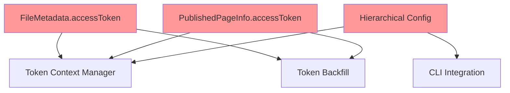
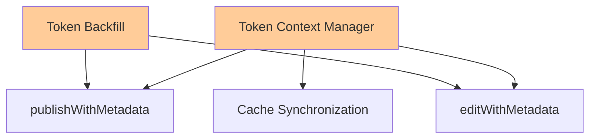
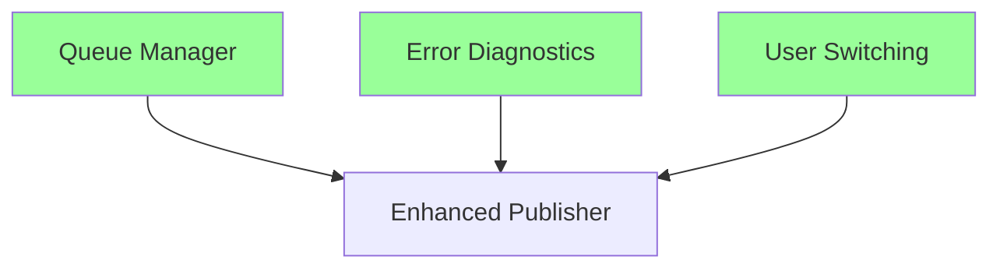

# VAN Analysis: Comprehensive Token Management System

## Value Analysis & Navigation Complete

**Analysis Date:** 2025-08-07_10-38
**Complexity Assessment:** HIGH - Auto-decomposition triggered
**Implementation Strategy:** Multi-phase connectivity-based approach

---

## 🎯 Value Proposition Analysis

### **Primary Value Drivers**
1. **Operational Excellence:** Eliminate 57-minute rate-limit blocking через intelligent queue management
2. **Data Integrity:** Ensure correct token usage для каждой страницы through hierarchical resolution
3. **User Experience:** Seamless token management без manual intervention
4. **System Reliability:** Backward compatibility с zero breaking changes
5. **Performance Optimization:** Maximize throughput через smart postponement strategies

### **Strategic Benefits**
- **For Content Creators:** Transparent multi-user workflow с automatic token management
- **For System Administrators:** Hierarchical configuration через project-level token settings
- **For Developers:** Rich diagnostic information при token-related errors
- **For Operations:** Continuous progress вместо blocking waits

---

## 🧩 Complexity Analysis & Auto-Decomposition

### **Complexity Indicators Detected**
- ✅ **Component Count:** 6 взаимосвязанных sub-systems requiring coordinated implementation
- ✅ **Dependency Density:** HIGH - строгая последовательность реализации required
- ✅ **Technical Scope:** Multiple layers (data models, business logic, UI integration)
- ✅ **Integration Requirements:** Extensive cross-system integration points
- ✅ **Specification Volume:** Comprehensive documentation с detailed pseudocode

### **Connectivity Analysis Results**

#### **Most Connected Components (Foundation Layer)**

**Rationale:** Data models и configuration являются fundamental building blocks - ALL other components depend on these structures.

#### **Medium Connected Components (Core Logic Layer)**

**Rationale:** Core business logic using foundation layer и providing services to advanced features.

#### **Independent Components (Advanced Features Layer)**

**Rationale:** Advanced features operating on top of established foundation с minimal interdependencies.

---

## 📋 Requirements Extraction & Mapping

### **R1: Data Structure Foundation**
- **REQ-2.1:** FileMetadata interface расширение с optional accessToken field
- **REQ-2.2:** PublishedPageInfo interface расширение с optional accessToken field
- **REQ-2.3:** YAML parsing logic для accessToken extraction
- **REQ-2.4:** YAML serialization logic для accessToken persistence
- **REQ-2.5:** MetadataManager.createMetadata() с accessToken parameter
- **REQ-2.6:** Cache manager integration для accessToken storage

**Business Value:** ⭐⭐⭐⭐⭐ (Critical foundation)
**Technical Complexity:** ⭐⭐ (Low - interface extensions)
**Implementation Risk:** ⭐ (Very Low - backward compatible changes)

### **R2: Hierarchical Configuration System**
- **REQ-6.1:** ConfigManager.loadHierarchicalConfig() method implementation
- **REQ-6.2:** Deep merge algorithm для configuration combining
- **REQ-6.3:** Configuration caching mechanism для performance
- **REQ-6.4:** EnhancedCommands integration для CLI workflow

**Business Value:** ⭐⭐⭐⭐ (High - project-level configuration)
**Technical Complexity:** ⭐⭐⭐ (Medium - file system traversal)
**Implementation Risk:** ⭐⭐ (Low - isolated component)

### **R3: Token Context Management**
- **REQ-3.1:** getEffectiveAccessToken() hierarchy implementation
- **REQ-3.2:** Metadata token source (highest priority)
- **REQ-3.3:** Cache token source (high priority)
- **REQ-3.4:** Config token source (medium priority)
- **REQ-3.5:** Session token source (fallback)
- **REQ-3.6:** Token context isolation между files

**Business Value:** ⭐⭐⭐⭐⭐ (Critical - core functionality)
**Technical Complexity:** ⭐⭐⭐ (Medium - state management)
**Implementation Risk:** ⭐⭐ (Low - well-defined hierarchy)

### **R4: Token Persistence & Backfill**
- **REQ-1.1:** New publication token automatic saving
- **REQ-1.2:** Legacy file token backfill mechanism
- **REQ-1.3:** publishWithMetadata() integration
- **REQ-1.4:** editWithMetadata() integration
- **REQ-1.5:** Cache consistency с file metadata

**Business Value:** ⭐⭐⭐⭐ (High - data integrity)
**Technical Complexity:** ⭐⭐⭐ (Medium - file manipulation)
**Implementation Risk:** ⭐⭐ (Low - leverages existing patterns)

### **R5: Intelligent Queue Management**
- **REQ-4.1:** PostponedFileInfo data structure
- **REQ-4.2:** QueueDecision interface
- **REQ-4.3:** QueueStats tracking
- **REQ-4.4:** handleRateLimit() decision logic
- **REQ-4.5:** processFinalRetries() mechanism
- **REQ-4.6:** 30-second threshold configuration
- **REQ-4.7:** MAX_RETRY_ATTEMPTS enforcement

**Business Value:** ⭐⭐⭐⭐⭐ (Critical - performance optimization)
**Technical Complexity:** ⭐⭐⭐⭐ (High - complex state management)
**Implementation Risk:** ⭐⭐⭐ (Medium - timing-sensitive logic)

### **R6: Comprehensive Integration**
- **REQ-5.1:** publishDependencies() refactoring
- **REQ-5.2:** publishNodes() FLOOD_WAIT handling
- **REQ-5.3:** editPage() PAGE_ACCESS_DENIED handling
- **REQ-5.4:** createNewUserAndSwitch() logic
- **REQ-5.5:** Enhanced error diagnostics

**Business Value:** ⭐⭐⭐⭐⭐ (Critical - user experience)
**Technical Complexity:** ⭐⭐⭐⭐ (High - multiple integration points)
**Implementation Risk:** ⭐⭐⭐ (Medium - extensive testing required)

---

## 🏗️ Sub-Phase Decomposition Strategy

### **Sub-Phase 1: Foundation Layer** 
**Target Components:** Data models и configuration infrastructure
**Dependencies:** None (pure foundation)
**Estimated Effort:** 25% of total implementation
**Risk Level:** LOW

**Implementation Scope:**
- Task 2: Data structure extensions (REQ-2.x)
- Task 6: Hierarchical configuration (REQ-6.x)

**Success Criteria:**
- ✅ All interfaces contain optional accessToken fields
- ✅ Hierarchical config loading works with deep merge
- ✅ Zero breaking changes to existing code
- ✅ 85% test coverage for new components

### **Sub-Phase 2: Core Logic Layer**
**Target Components:** Token management business logic
**Dependencies:** Sub-Phase 1 (foundation data structures)
**Estimated Effort:** 35% of total implementation
**Risk Level:** MEDIUM

**Implementation Scope:**
- Task 3: Token Context Manager (REQ-3.x)
- Task 1: Token backfill mechanisms (REQ-1.x)

**Success Criteria:**
- ✅ Token hierarchy resolves correctly in all scenarios
- ✅ Backfill works for both new и legacy files
- ✅ Context isolation prevents token leakage
- ✅ Integration tests pass for token workflows

### **Sub-Phase 3: Advanced Features Layer**
**Target Components:** Queue optimization и comprehensive integration
**Dependencies:** Sub-Phase 1 + Sub-Phase 2 (complete foundation)
**Estimated Effort:** 40% of total implementation
**Risk Level:** MEDIUM-HIGH

**Implementation Scope:**
- Task 4: IntelligentRateLimitQueueManager (REQ-4.x)
- Task 5: Publisher integration (REQ-5.x)

**Success Criteria:**
- ✅ Queue intelligence optimizes throughput
- ✅ Error diagnostics provide actionable guidance
- ✅ End-to-end workflows operate seamlessly
- ✅ Performance benchmarks demonstrate improvement

---

## 🔄 Integration Points & Dependencies

### **Critical Integration Points**
1. **Foundation → Core Logic:**
   - Data models provide structure для token storage
   - Config system provides hierarchical token sources
   - Validation: Core logic can read/write tokens correctly

2. **Core Logic → Advanced Features:**
   - Token management provides context для queue decisions
   - Backfill ensures data consistency для advanced workflows
   - Validation: Advanced features leverage reliable token system

3. **Advanced Features → User Experience:**
   - Queue optimization prevents blocking waits
   - Error diagnostics guide user resolution
   - Validation: Complete workflow provides seamless experience

### **Risk Mitigation Strategies**
- **Integration Risk:** Phased rollout с validation at each checkpoint
- **Performance Risk:** Benchmarking после each sub-phase
- **Compatibility Risk:** Automated regression testing
- **User Experience Risk:** Real-world scenario testing

---

## 📊 Success Metrics & Validation

### **Foundation Layer Metrics**
- **Functionality:** All new data fields accessible via existing APIs
- **Performance:** Config loading time < 50ms для typical projects
- **Compatibility:** Zero test failures в existing test suite
- **Documentation:** Complete interface documentation

### **Core Logic Layer Metrics**
- **Functionality:** Token resolution accuracy = 100% в all test scenarios
- **Performance:** Token resolution time < 10ms per file
- **Reliability:** Zero token leakage между file operations
- **User Experience:** Clear logging для token source selection

### **Advanced Features Layer Metrics**
- **Functionality:** Queue optimization reduces wait time by >80%
- **Performance:** Throughput improvement measurable в real scenarios
- **Reliability:** Error recovery success rate >95%
- **User Experience:** Diagnostic messages actionable в >90% of cases

---

## 🚀 Next Phase Preparation

### **VAN Analysis Conclusions**
✅ **Complex task confirmed** - auto-decomposition required и validated
✅ **Implementation sequence optimized** - connectivity analysis complete
✅ **Risk assessment comprehensive** - mitigation strategies defined
✅ **Success criteria established** - measurable validation framework

### **PLAN Phase Readiness**
**Ready for detailed hierarchical planning:**
- Sub-phase boundaries clearly defined
- Integration points thoroughly analyzed
- Risk mitigation strategies established
- Success validation framework confirmed

**Planning Approach:**
- **Iterative sub-phase planning** (SP-1 → SP-2 → SP-3)
- **Continuous integration validation** between phases
- **Risk-driven milestone definitions**
- **User experience validation checkpoints**

---

**VAN Analysis Status:** ✅ COMPLETE
**Next Phase:** PLAN (Sub-Phase Implementation Planning)
**Confidence Level:** HIGH (comprehensive specification + clear decomposition strategy) 