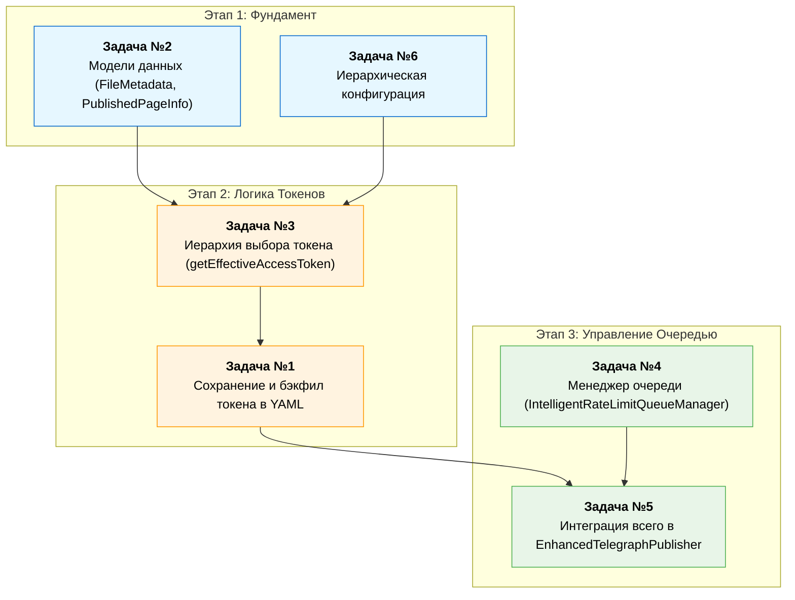

### **Оптимальная Последовательность Реализации Задач**

#### **Этап 1: Фундамент — Модели Данных и Конфигурация**

Эти задачи создают основу, на которую будут опираться все остальные. Их нужно делать в первую очередь.

1.  **Задача №2: Интеграция Токена в Метаданные и Кэш**
    *   **Что делаем:** Расширяем интерфейсы `FileMetadata` и `PublishedPageInfo`. Учим `MetadataManager` и `PagesCacheManager` читать и записывать новое поле `accessToken`.
    *   **Почему первая:** Это самое базовое изменение на уровне структур данных. Без него нельзя реализовать ни сохранение токена в файл (Задача №1), ни его чтение (Задача №3).

2.  **Задача №6: Иерархическая Загрузка Конфигурации**
    *   **Что делаем:** Реализуем в `ConfigManager` новый метод `loadHierarchicalConfig`, который ищет и объединяет `.telegraph-publisher-config.json` вверх по дереву каталогов.
    *   **Почему вторая:** Эта задача определяет, как система получает конфигурацию по умолчанию, включая `accessToken` из конфигов. Ее нужно реализовать до того, как мы будем строить полную иерархию разрешения токенов (Задача №3), так как она предоставляет один из ключевых источников.

---

#### **Этап 2: Логика Выбора и Сохранения Токенов**

Теперь, когда структуры данных и конфигурация готовы, можно реализовать основную логику работы с токенами.

3.  **Задача №3: Иерархия Разрешения Токенов (Token Context Manager)**
    *   **Что делаем:** Создаем метод `getEffectiveAccessToken` в `EnhancedTelegraphPublisher`, который реализует строгую иерархию выбора токена (метаданные -> кэш -> иерархический конфиг -> сессия).
    *   **Почему третья:** Она напрямую зависит от Задач №2 (для чтения токена из метаданных/кэша) и №6 (для чтения из иерархической конфигурации). Это центральный "мозг" системы управления токенами.

4.  **Задача №1: Добавление `accessToken` в YAML Front-Matter (Сохранение и Бэкфил)**
    *   **Что делаем:** Интегрируем вызов `getEffectiveAccessToken` в `publishWithMetadata` и `editWithMetadata`. Реализуем логику сохранения токена для новых файлов и "бэкфила" для старых.
    *   **Почему четвертая:** Эта задача является "замыкающей" для цикла работы с токенами. Она использует `getEffectiveAccessToken` (Задача №3) для выбора токена, а затем сохраняет его в структуры, подготовленные в Задаче №2.

---

#### **Этап 3: Продвинутая Логика Обработки Очереди**

Эта задача самая сложная и зависит от уже работающей системы публикации. Ее следует выполнять последней.

5.  **Задача №4: Интеллектуальный Менеджер Очереди Публикации**
    *   **Что делаем:** Создаем новый класс `IntelligentRateLimitQueueManager` для управления очередью и принятия решений при `rate-limit`.
    *   **Почему пятая (почти последняя):** Эта логика работает "поверх" уже существующего механизма публикации. Она перехватывает ошибки и управляет порядком вызовов, но сам вызов `publish` для каждого файла должен уже корректно работать с токенами.

6.  **Задача №5: Интеграция Новой Логики в `EnhancedTelegraphPublisher`**
    *   **Что делаем:** Перерабатываем `publishDependencies` для использования `IntelligentRateLimitQueueManager`. Модифицируем `publishNodes` и `editPage` для новой логики обработки `FLOOD_WAIT` и `PAGE_ACCESS_DENIED`.
    *   **Почему последняя:** Это финальный шаг, который "склеивает" все вместе. Он интегрирует менеджер очереди (Задача №4) в основной рабочий процесс, который уже умеет правильно работать с токенами (благодаря задачам 1, 2, 3, 6).

### **Визуальная Схема Зависимостей**



**Итоговый план:** **2 → 6 → 3 → 1 → 4 → 5**. Следуя этому порядку, вы будете строить функционал на уже готовом и протестированном фундаменте на каждом шаге.

### **Детальная Техническая Спецификация: Задача №1**

**Название задачи:** Реализация сохранения и "бэкфила" `accessToken` в метаданных файла (YAML Front-Matter).

**Цель:** Модифицировать рабочий процесс публикации и редактирования таким образом, чтобы `accessToken`, использованный для успешной операции, сохранялся непосредственно в YAML-заголовке markdown-файла.

**Компоненты для модификации:**
*   `src/publisher/EnhancedTelegraphPublisher.ts` (основная логика)
*   `src/metadata/MetadataManager.ts` (вспомогательная логика)

---

#### **1. Ключевые Сценарии**

Эта задача затрагивает два основных сценария:

1.  **Новая Публикация:** Когда файл публикуется впервые, `accessToken`, использованный для создания страницы, должен быть немедленно сохранен в его метаданных.
2.  **Обновление Существующей Страницы (Бэкфил):** Когда редактируется файл, который был опубликован ранее (до внедрения этого функционала) и **не содержит** `accessToken` в своих метаданных, система должна добавить использованный для редактирования токен в его front-matter. Этот процесс называется "бэкфил" (backfill).

---

#### **2. Детальная Логика Реализации**

##### **2.1. Логика для Новых Публикаций**

**Файл:** `src/publisher/EnhancedTelegraphPublisher.ts`
**Метод:** `publishWithMetadata(...)`

*   **Назначение:** Обеспечить, чтобы после создания новой страницы на Telegra.ph, использованный токен сохранялся в файл.
*   **Алгоритм:**
    1.  **Внутри `try` блока, после успешного вызова `this.publishNodes(...)`:**
        *   К этому моменту у нас есть объект `page` (результат от API) и `effectiveToken`, который был определен логикой из Задачи №3 и использован для публикации.
    2.  **Вызов `MetadataManager.createMetadata(...)`:**
        *   При вызове этого метода **обязательно** передать `effectiveToken` в качестве нового, последнего параметра.
        ```typescript
        // Пример
        const metadata = MetadataManager.createMetadata(
          page.url,
          page.path,
          username,
          filePath,
          contentHash,
          metadataTitle,
          undefined, // description
          effectiveToken // <-- ПЕРЕДАЧА ТОКЕНА
        );
        ```
    3.  **Запись в файл:**
        *   Дальнейшие вызовы `ContentProcessor.injectMetadataIntoContent` и `writeFileSync` автоматически запишут в файл метаданные, которые теперь содержат `accessToken`, так как `MetadataManager` был доработан в Задаче №2.
    4.  **Обновление кэша:**
        *   При вызове `this.addToCache(...)` также необходимо передать `effectiveToken`, чтобы кэш и файл были консистентны.

##### **2.2. Логика для Существующих Публикаций (Бэкфил)**

**Файл:** `src/publisher/EnhancedTelegraphPublisher.ts`
**Метод:** `editWithMetadata(...)`

*   **Назначение:** Модернизировать старые файлы без `accessToken`, добавляя его в метаданные после первого успешного редактирования.
*   **Алгоритм:**
    1.  **В начале метода:**
        *   Загрузить существующие метаданные: `const existingMetadata = MetadataManager.getPublicationInfo(filePath);`.
    2.  **После успешного вызова `this.editPage(...)`:**
        *   К этому моменту у нас есть `effectiveToken`, который был использован для успешного редактирования.
    3.  **Проверка на необходимость "бэкфила":**
        *   Добавить условие: `if (existingMetadata && !existingMetadata.accessToken)`. Это условие истинно, если файл был опубликован, но токен в нем не сохранен.
    4.  **Выполнение "бэкфила":**
        *   Если условие истинно:
            a.  Вывести информационное сообщение в лог:
                ```
                console.log(`🔄 Token backfill: Saving effective token to metadata for ${basename(filePath)}.`);
                ```
            b.  Создать объект `updatedMetadata`, скопировав `existingMetadata` и добавив/перезаписав в нем `accessToken`.
                ```typescript
                const updatedMetadata: FileMetadata = {
                  ...existingMetadata,
                  publishedAt: new Date().toISOString(), // Обновляем дату
                  title: metadataTitle,
                  contentHash: updatedContentHash,
                  accessToken: effectiveToken // <-- ДОБАВЛЕНИЕ ТОКЕНА
                };
                ```
            c.  Использовать `ContentProcessor.injectMetadataIntoContent` и `writeFileSync` для перезаписи файла с уже полными метаданными.
    5.  **Обновление кэша:**
        *   При вызове `this.cacheManager.updatePage(...)` убедиться, что `accessToken` также передается в объекте `updates`, чтобы кэш был синхронизирован с файлом.


#### **3. Псевдокод Интеграции**

```typescript
// Внутри EnhancedTelegraphPublisher.ts

async publishWithMetadata(filePath, username, options) {
    const originalSessionToken = this.currentAccessToken;
    try {
        // ...
        // Определяем effectiveToken согласно Задаче №3
        const { token: effectiveToken } = this.getEffectiveAccessToken(...);
        this.setAccessToken(effectiveToken);
        // ...

        // ---- СЦЕНАРИЙ НОВОЙ ПУБЛИКАЦИИ ----
        // ...
        const page = await this.publishNodes(title, telegraphNodes);
        
        // **ЗАДАЧА №1: Сохранение токена при создании**
        const metadata = MetadataManager.createMetadata(..., effectiveToken); // Передаем токен
        // ...
        // Записываем файл с метаданными, которые теперь содержат токен
        // ...
        this.addToCache(..., effectiveToken); // Передаем токен в кэш

    } finally {
        // Восстанавливаем токен сессии
        if (this.currentAccessToken !== originalSessionToken) {
            this.setAccessToken(originalSessionToken);
        }
    }
}

async editWithMetadata(filePath, username, options) {
    const originalSessionToken = this.currentAccessToken;
    try {
        const existingMetadata = MetadataManager.getPublicationInfo(filePath);
        // ...
        // Определяем effectiveToken согласно Задаче №3
        const { token: effectiveToken } = this.getEffectiveAccessToken(...);
        this.setAccessToken(effectiveToken);
        // ...

        // ---- СЦЕНАРИЙ РЕДАКТИРОВАНИЯ ----
        // ...
        const page = await this.editPage(...);

        // **ЗАДАЧА №1: Логика "бэкфила"**
        const updatedMetadata = { ...existingMetadata, ... };
        if (existingMetadata && !existingMetadata.accessToken) {
            console.log(`Token backfill for ${basename(filePath)}...`);
            updatedMetadata.accessToken = effectiveToken; // <-- БЭКФИЛ
        }

        // Записываем файл с обновленными/дополненными метаданными
        // ...
        this.cacheManager.updatePage(..., { accessToken: effectiveToken }); // Обновляем кэш с токеном

    } finally {
        // Восстанавливаем токен сессии
        if (this.currentAccessToken !== originalSessionToken) {
            this.setAccessToken(originalSessionToken);
        }
    }
}
```


#### **4. Критерии Приемки (Acceptance Criteria)**

*   ✅ **Новый Файл:** После первой успешной публикации `telegraph-publisher pub -f new_file.md`, в файле `new_file.md` появляется YAML front-matter с ключом `accessToken`.
*   ✅ **Старый Файл:** Имеется старый опубликованный файл `old_file.md` без `accessToken`. После успешного запуска `telegraph-publisher pub -f old_file.md`, в `old_file.md` автоматически добавляется ключ `accessToken` в существующий YAML front-matter.
*   ✅ **Консистентность:** Значение `accessToken`, сохраненное в файле, точно соответствует тому токену, который был использован для API-запроса (определенному по иерархии из Задачи №3).
*   ✅ **Надежность:** Процесс не вызывает ошибок, если файл уже содержит `accessToken` (в этом случае он просто перезаписывается, если изменился).
*   ✅ **Интеграция с Кэшем:** После "бэкфила" токена в файл, соответствующая запись в `.telegraph-pages-cache.json` также обновляется и содержит этот `accessToken`.

### **Детальная Техническая Спецификация: Задача №2**

**Название задачи:** Интеграция `accessToken` в Модели Данных, Метаданные и Кэш

**Цель:** Расширить существующие структуры данных (`FileMetadata`, `PublishedPageInfo`) и связанные с ними механизмы (парсер YAML, менеджер кэша) для поддержки хранения и извлечения `accessToken` для каждой отдельной страницы.

**Компоненты для модификации:**
*   `src/types/metadata.ts`
*   `src/metadata/MetadataManager.ts`
*   `src/cache/PagesCacheManager.ts`
*   `src/publisher/EnhancedTelegraphPublisher.ts` (метод `addToCache`)


#### **1. Расширение Интерфейсов (Модель Данных)**

**Файл:** `src/types/metadata.ts`

**1.1. Модификация `FileMetadata`**
*   **Назначение:** Определить поле для хранения токена в YAML front-matter.
*   **Действие:** Добавить новое **необязательное** поле `accessToken`. Необязательность критична для обратной совместимости со старыми файлами.
*   **Реализация:**
    ```typescript
    export interface FileMetadata {
      // ... существующие поля (telegraphUrl, editPath, etc.)
      contentHash?: string;

      /**
       * Access token used for publication. Stored directly in the file's
       * front-matter to ensure the correct user context is always used for edits.
       * @optional
       */
      accessToken?: string;
    }
    ```

**1.2. Модификация `PublishedPageInfo`**
*   **Назначение:** Определить поле для хранения токена в кэше (`.telegraph-pages-cache.json`).
*   **Действие:** Добавить новое **необязательное** поле `accessToken`.
*   **Реализация:**
    ```typescript
    export interface PublishedPageInfo {
      // ... существующие поля (telegraphUrl, editPath, title, etc.)
      contentHash?: string;

      /**
       * Access token associated with this page. Used for restoring metadata
       * and ensuring the correct user context during dependency publishing.
       * @optional
       */
      accessToken?: string;
    }
    ```


#### **2. Интеграция в Управление Метаданными (YAML Front-Matter)**

**Файл:** `src/metadata/MetadataManager.ts`

**2.1. Чтение Токена из YAML (`parseYamlMetadata`)**
*   **Назначение:** Научить парсер извлекать `accessToken` из блока front-matter.
*   **Действие:** Внутри `switch (key)` или логики парсинга добавить новый `case`.
*   **Реализация:**
    ```typescript
    // Внутри parseYamlMetadata
    // ...
    switch (key) {
        // ... существующие case'ы
        case 'contentHash':
          metadata.contentHash = value;
          break;
        case 'accessToken': // <-- НОВЫЙ CASE
          metadata.accessToken = value;
          break;
    }
    // ...
    ```

**2.2. Запись Токена в YAML (`serializeMetadata` или аналогичный)**
*   **Назначение:** Научить менеджер метаданных записывать `accessToken` в блок front-matter при создании или обновлении.
*   **Действие:** В методе, который генерирует YAML-строку, добавить проверку наличия `accessToken` в объекте `metadata` и, если он есть, добавлять его в YAML.
*   **Реализация:**
    ```typescript
    // Внутри serializeMetadata
    // ...
    if (metadata.contentHash) {
      lines.push(`contentHash: "${metadata.contentHash}"`);
    }

    if (metadata.accessToken) { // <-- НОВАЯ ЛОГИКА
      lines.push(`accessToken: "${metadata.accessToken}"`);
    }
    // ...
    ```

**2.3. Обновление `createMetadata`**
*   **Назначение:** Позволить создавать объект `FileMetadata` сразу с токеном.
*   **Действие:** Добавить новый необязательный параметр `accessToken?: string` в сигнатуру метода.
*   **Реализация:**
    ```typescript
    // src/metadata/MetadataManager.ts
    static createMetadata(
      url: string,
      path: string,
      username: string,
      filePath: string,
      contentHash: string,
      title?: string,
      description?: string,
      accessToken?: string // <-- НОВЫЙ ПАРАМЕТР
    ): FileMetadata {
      return {
        // ... существующие поля
        contentHash,
        accessToken // <-- ПРИСВОЕНИЕ
      };
    }
    ```

---

#### **3. Интеграция в Менеджер Кэша**

**Файл:** `src/cache/PagesCacheManager.ts`

**Назначение:** Обеспечить персистентное хранение `accessToken` в файле кэша для быстрого доступа и восстановления. Логика здесь минимальна, так как `PublishedPageInfo` уже расширен. Нужно лишь убедиться, что существующие методы корректно обрабатывают новое поле.

**3.1. Метод `addPage(pageInfo: PublishedPageInfo)`**
*   **Действие:** Никаких изменений не требуется, если метод просто сохраняет весь объект `pageInfo`. `pageInfo.accessToken` будет сохранен автоматически.
*   **Проверка (Audit):** Убедиться, что `this.cache.pages[pageInfo.telegraphUrl] = pageInfo;` сохраняет весь объект, а не создает новый с избранными полями. Текущий код (`PagesCacheManager.ts:168`) делает это правильно.

**3.2. Метод `updatePage(telegraphUrl: string, updates: Partial<PublishedPageInfo>)`**
*   **Действие:** Никаких изменений не требуется. Оператор `...updates` автоматически применит `accessToken`, если он будет передан в объекте `updates`.
*   **Проверка (Audit):** Убедиться, что метод корректно сливает `updates` с существующим объектом. Текущий код (`PagesCacheManager.ts:182`) делает это правильно: `const updatedPage = { ...existingPage, ...updates, ... }`.

**3.3. Метод `syncWithTelegraph(publisher: TelegraphPublisher)`**
*   **Действие:** Этот метод получает данные из API Telegraph, где **нет** `accessToken`. Поэтому при синхронизации поле `accessToken` в кэше будет `undefined` для страниц, полученных этим методом. **Это ожидаемое и правильное поведение.** Логика "бэкфила" (задача 5) позже заполнит это поле при необходимости.

---

#### **4. Интеграция в `EnhancedTelegraphPublisher`**

**Файл:** `src/publisher/EnhancedTelegraphPublisher.ts`

**4.1. Метод `addToCache`**
*   **Назначение:** Убедиться, что при добавлении новой страницы в кэш мы передаем `accessToken`, с которым она была опубликована.
*   **Действие:** Модифицировать сигнатуру и тело метода.
*   **Реализация:**
    ```typescript
    // Сигнатура
    private addToCache(filePath: string, url: string, path: string, title: string, username: string, contentHash?: string, accessToken?: string): void;

    // Тело метода
    private addToCache(...) {
      if (this.cacheManager) {
        const pageInfo: PublishedPageInfo = {
          // ... существующие поля
          contentHash: contentHash,
          accessToken: accessToken || this.currentAccessToken // <-- НОВАЯ ЛОГИКА
        };
        this.cacheManager.addPage(pageInfo);
      }
    }
    ```
    *   **Логика:** Метод должен принимать `accessToken`. Если он не передан, используется токен текущей сессии (`this.currentAccessToken`) в качестве fallback. Это гарантирует, что у каждой новой записи в кэше будет токен.

---

#### **5. Критерии Приемки (Acceptance Criteria)**

*   ✅ **Типы:** Интерфейсы `FileMetadata` и `PublishedPageInfo` содержат необязательное поле `accessToken: string`.
*   ✅ **Запись в файл:** После публикации нового файла, его YAML front-matter содержит ключ `accessToken` со значением использованного токена.
*   ✅ **Чтение из файла:** `MetadataManager.getPublicationInfo()` корректно считывает `accessToken` из файла, если он там присутствует.
*   ✅ **Запись в кэш:** После публикации нового файла, запись для него в `.telegraph-pages-cache.json` содержит ключ `accessToken`.
*   ✅ **Обратная совместимость:** Система не падает и корректно работает со старыми файлами и записями в кэше, где поле `accessToken` отсутствует. `MetadataManager.parseMetadata` и `PagesCacheManager.loadCache` должны возвращать `undefined` для этого поля, не вызывая ошибок.

Эта спецификация полностью описывает необходимые изменения для создания "слоя данных", который позволит реализовать более сложную логику управления токенами в последующих задачах.

### **Детальная Техническая Спецификация: Задача №3**

**Название компонента/паттерна:** Token Context Manager (реализуется внутри `EnhancedTelegraphPublisher`)

**Цель:** Создать иерархическую систему для определения наиболее подходящего `accessToken` для публикации или редактирования файла, с четко определенными приоритетами, чтобы гарантировать использование правильного токена для каждой страницы.

**Расположение:** `src/publisher/EnhancedTelegraphPublisher.ts` (основная логика) и `src/config/ConfigManager.ts` (вспомогательная логика).

---

#### **1. Принципы Проектирования**

*   **Контекстная Осведомленность:** Выбор токена должен зависеть от контекста конкретного файла, а не только от глобальных настроек сессии.
*   **Четкий Приоритет:** Иерархия источников токенов должна быть строгой и однозначной, чтобы избежать путаницы.
*   **Обратная Совместимость:** Система должна корректно работать со старыми файлами и кэшем, где `accessToken` еще не был сохранен.
*   **Изоляция Операций:** Временное использование токена для одного файла не должно "загрязнять" контекст для следующего файла в очереди.
*   **Информативная Диагностика:** В случае ошибки (например, `PAGE_ACCESS_DENIED`) система должна предоставлять пользователю полезную информацию о возможном несоответствии токенов.

---

#### **2. Иерархия Источников Токенов (по убыванию приоритета)**

Система должна проверять наличие токена в следующем порядке и использовать первый найденный:

1.  **Токен из Метаданных Файла (`FileMetadata`):**
    *   **Источник:** Поле `accessToken` в YAML front-matter самого markdown-файла.
    *   **Приоритет:** **Высший.** Если токен явно указан в файле, он должен использоваться всегда, переопределяя все остальные источники.
    *   **Сценарий:** Редактирование страницы, которая была опубликована конкретным пользователем и токен которого "привязан" к файлу.

2.  **Токен из Кэша (`PublishedPageInfo`):**
    *   **Источник:** Поле `accessToken` в записи, соответствующей файлу, в `.telegraph-pages-cache.json`.
    *   **Приоритет:** **Высокий.** Используется, если в самом файле метаданные (и токен) отсутствуют, но есть в кэше.
    *   **Сценарий:** Восстановление метаданных для файла, который был удален или поврежден, но информация о его публикации сохранилась в кэше.

3.  **Токен из Иерархической Конфигурации:**
    *   **Источник:** Поле `accessToken` из объединенной конфигурации, полученной иерархическим поиском файлов `.telegraph-publisher-config.json` (согласно Задаче №6).
    *   **Приоритет:** **Средний.** Этот токен представляет собой "локальный" или "глобальный" токен по умолчанию для проекта или его части.
    *   **Сценарий:** Публикация нового файла в проекте, где для определенной директории (или всего проекта) задан свой токен, отличающийся от токена, с которым был запущен CLI.

4.  **Токен Текущей Сессии:**
    *   **Источник:** Токен, хранящийся в свойстве `this.currentAccessToken` экземпляра `EnhancedTelegraphPublisher`.
    *   **Приоритет:** **Низкий (fallback).** Это токен, который был передан через CLI (`--token`) или загружен при инициализации.
    *   **Сценарий:** Стандартная публикация, когда нет специфических токенов в файлах или конфигах.

---

#### **3. Реализация**

##### **3.1. Приватный Метод `getEffectiveAccessToken`**

**Файл:** `src/publisher/EnhancedTelegraphPublisher.ts`

**Сигнатура:**
```typescript
private getEffectiveAccessToken(
  filePath: string,
  metadata: FileMetadata | null,
  cacheInfo: PublishedPageInfo | null,
  hierarchicalConfig: MetadataConfig // Загруженный конфиг
): { token: string; source: 'metadata' | 'cache' | 'config' | 'session' } {
```

*   **Назначение:** Инкапсулировать логику выбора токена согласно иерархии. Возвращает не только токен, но и его источник для логирования и отладки.
*   **Алгоритм:**
    1.  `if (metadata?.accessToken)`: вернуть `{ token: metadata.accessToken, source: 'metadata' }`.
    2.  `else if (cacheInfo?.accessToken)`: вернуть `{ token: cacheInfo.accessToken, source: 'cache' }`.
    3.  `else if ((hierarchicalConfig as any).accessToken)`: // Поддержка старого поля в конфиге
        *   вернуть `{ token: (hierarchicalConfig as any).accessToken, source: 'config' }`.
    4.  `else if (this.currentAccessToken)`: вернуть `{ token: this.currentAccessToken, source: 'session' }`.
    5.  `else`: выбросить `new Error('No access token available for {basename(filePath)}...')`.

##### **3.2. Интеграция в `publishWithMetadata` и `editWithMetadata`**

**Файл:** `src/publisher/EnhancedTelegraphPublisher.ts`

**Задача:** Обеспечить безопасное временное переключение контекста токена для каждой операции.

*   **Алгоритм:**
    1.  **Сохранить контекст:** В начале метода сохранить текущий токен сессии.
        ```typescript
        const originalSessionToken = this.currentAccessToken;
        ```
    2.  **Определить и установить рабочий токен:** Внутри блока `try`:
        ```typescript
        // ... (загрузка config, metadata, cacheInfo)
        const { token: effectiveToken, source: tokenSource } = this.getEffectiveAccessToken(...);
        
        // Логируем, какой токен используется
        console.log(`🔑 Using ${tokenSource} token for ${basename(filePath)}.`);

        this.setAccessToken(effectiveToken); // Временно устанавливаем рабочий токен
        ```
    3.  **Выполнить операцию:** Выполнить все действия по публикации или редактированию (`publishNodes`, `editPage`, `publishDependencies` и т.д.).
    4.  **Восстановить контекст:** В блоке `finally` **обязательно** восстановить исходный токен.
        ```typescript
        finally {
          if (this.currentAccessToken !== originalSessionToken) {
            this.setAccessToken(originalSessionToken);
            console.log(`🔄 Restored original session token.`);
          }
        }
        ```

##### **3.3. Логика "Бэкфила" Токена (Token Backfill)**

*   **Назначение:** Автоматически обновлять старые файлы, добавляя в их метаданные `accessToken`, чтобы при последующих запусках система сразу знала, какой токен использовать.
*   **Место реализации:** Внутри `publishWithMetadata` и `editWithMetadata`, после успешной операции.
*   **Алгоритм:**
    1.  Получить `updatedMetadata` после успешной публикации/редактирования.
    2.  Проверить, был ли токен в исходных метаданных: `if (!existingMetadata?.accessToken)`.
    3.  Если токена не было, значит, это старый файл, и мы только что успешно с ним поработали, используя `effectiveToken`.
    4.  Добавить токен в метаданные: `updatedMetadata.accessToken = effectiveToken`.
    5.  Перезаписать markdown-файл с обновленными метаданными: `writeFileSync(filePath, contentWithNewMetadata, 'utf-8')`.
    6.  Вывести в лог информационное сообщение: `✅ Token backfilled for {basename(filePath)}. Future edits will use this token directly.`.
    7.  Также обновить запись в кэше, передав `effectiveToken`.

---

#### **4. Критерии Приемки (Acceptance Criteria)**

*   ✅ **Приоритет №1 (Метаданные):** При запуске `publish` для файла, в YAML которого прописан `accessToken: "token_A"`, для API-запроса используется именно `"token_A"`, даже если в CLI был передан `--token "token_B"`.
*   ✅ **Приоритет №2 (Кэш):** Если у файла нет метаданных, но в кэше для него есть запись с `accessToken: "token_C"`, метаданные восстанавливаются с этим токеном, и он же используется для публикации.
*   ✅ **Приоритет №3 (Конфиг):** Если в файле и кэше токена нет, но в `.telegraph-publisher-config.json` в той же директории есть `accessToken: "token_D"`, используется `"token_D"`.
*   ✅ **Приоритет №4 (Сессия):** Если ни один из вышеперечисленных источников не дал токен, используется токен, с которым был запущен `publisher` (например, из CLI).
*   ✅ **Изоляция:** После обработки файла с `accessToken: "token_A"`, при обработке следующего файла (без своего токена) используется токен сессии (`"token_B"`), а не `"token_A"`.
*   ✅ **Бэкфил:** После успешного редактирования файла без `accessToken` в метаданных, в markdown-файл автоматически добавляется поле `accessToken` с тем токеном, который был использован для операции.
*   ✅ **Безопасность:** В случае, если ни один токен не может быть определен, выбрасывается понятная ошибка, и процесс останавливается.

### **Детальная Техническая Спецификация: Задача №4**

**Название компонента:** `IntelligentRateLimitQueueManager`

**Цель:** Создать отказоустойчивый, неблокирующий механизм обработки очереди публикации, который максимизирует пропускную способность путем интеллектуального переноса файлов с длительными задержками (`FLOOD_WAIT`) в конец очереди и продолжения работы с другими файлами.

**Расположение файла:** `src/publisher/IntelligentRateLimitQueueManager.ts`

---

#### **1. Основные Обязанности Компонента**

*   **Отслеживание состояния:** Вести учет общего количества файлов, обработанных файлов и файлов, отложенных из-за `rate-limit`.
*   **Принятие решений:** На основе длительности задержки `FLOOD_WAIT` и состояния очереди принимать решение: ожидать (`wait`) или отложить и переупорядочить (`postpone`).
*   **Управление очередью:** Предоставлять логику для переупорядочивания массива-очереди, который будет управляться извне (в `EnhancedTelegraphPublisher`).
*   **Управление повторными попытками:** Отслеживать количество попыток для отложенных файлов и время, когда можно безопасно повторить публикацию.
*   **Финальная обработка:** Обеспечить механизм для повторной обработки всех отложенных файлов в конце основного цикла публикации.
*   **Логирование и обратная связь:** Предоставлять четкие и информативные сообщения о состоянии очереди и принимаемых решениях.

---

#### **2. Определение Класса и Интерфейсов**

**Файл:** `src/publisher/IntelligentRateLimitQueueManager.ts`

**2.1. Вспомогательные Интерфейсы (Data Structures)**

```typescript
// Информация об отложенном файле
export interface PostponedFileInfo {
  originalWaitTime: number; // Исходное время ожидания в секундах
  retryAfter: number;       // Timestamp (ms), после которого можно повторить
  postponedAt: number;      // Timestamp (ms), когда файл был отложен
  attempts: number;         // Количество попыток
}

// Решение, принимаемое менеджером
export interface QueueDecision {
  action: 'wait' | 'postpone';
  waitSeconds?: number; // Время ожидания (только для action: 'wait')
}

// Статистика очереди для логирования
export interface QueueStats {
  total: number;
  processed: number;
  postponed: number;
  remaining: number;
}
```

**2.2. Определение Класса `IntelligentRateLimitQueueManager`**

```typescript
export class IntelligentRateLimitQueueManager {
  // --- Константы ---
  private static readonly POSTPONE_THRESHOLD_SECONDS = 30; // Порог для переноса в конец очереди
  private static readonly MAX_RETRY_ATTEMPTS = 3;         // Макс. кол-во попыток для отложенного файла

  // --- Состояние ---
  private postponedFiles: Map<string, PostponedFileInfo> = new Map();
  private processedCount = 0;
  private totalFiles = 0;

  // --- Публичные методы ---
  public initialize(totalFiles: number): void;
  public async handleRateLimit(filePath: string, waitSeconds: number, processingQueue: string[]): Promise<QueueDecision>;
  public markSuccessful(filePath: string): void;
  public markFailed(filePath: string, error: string): void;
  public shouldRetryNow(filePath: string): boolean;
  public isPostponed(filePath: string): boolean;
  public async processFinalRetries(publishFn: (filePath: string) => Promise<PublicationResult>): Promise<PublicationResult[]>;
  public getQueueStats(): QueueStats;
  public getPostponedSummary(): string[];
}
```

---

#### **3. Детальная Логика Ключевых Методов**

**3.1. `handleRateLimit(filePath, waitSeconds, processingQueue)`**

Это основной метод принятия решений.

*   **Алгоритм:**
    1.  Получить контекст:
        *   `fileName = basename(filePath)`.
        *   `filesRemainingInQueue = processingQueue.length - 1`.
        *   `attempts = this.postponedFiles.get(filePath)?.attempts || 0`.
    2.  Определить, следует ли отложить файл, на основе критериев:
        *   `isLongWait = waitSeconds > POSTPONE_THRESHOLD_SECONDS`.
        *   `areOtherFilesAvailable = filesRemainingInQueue > 0`.
        *   `hasAttemptsLeft = attempts < MAX_RETRY_ATTEMPTS`.
    3.  **Если `isLongWait && areOtherFilesAvailable && hasAttemptsLeft`:**
        *   **Действие: Отложить (`postpone`)**
        *   Вывести в лог сообщение о решении отложить файл для оптимизации.
        *   Найти индекс `filePath` в `processingQueue`.
        *   Удалить элемент с этого индекса: `queue.splice(index, 1)`.
        *   Добавить элемент в конец: `queue.push(filePath)`.
        *   Обновить `this.postponedFiles`, добавив или обновив запись для `filePath`:
            *   `retryAfter = Date.now() + waitSeconds * 1000`.
            *   `attempts++`.
        *   Вернуть `{ action: 'postpone' }`.
    4.  **В противном случае:**
        *   **Действие: Ожидать (`wait`)**
        *   Вывести в лог сообщение о решении (например, "Короткое ожидание" или "Последний файл в очереди").
        *   Вернуть `{ action: 'wait', waitSeconds }`.

**3.2. `processFinalRetries(publishFn)`**

Этот метод вызывается после завершения основного цикла для обработки "хвоста" отложенных файлов.

*   **Алгоритм:**
    1.  Проверить, есть ли отложенные файлы. Если `this.postponedFiles.size === 0`, вернуть пустой массив.
    2.  Вывести в лог сообщение о начале финальной обработки.
    3.  Создать массив для результатов: `const results: PublicationResult[] = []`.
    4.  Итерировать по `this.postponedFiles.entries()`.
    5.  **Для каждого `[filePath, info]`:**
        *   Проверить, не превышен ли лимит попыток. Если `info.attempts >= MAX_RETRY_ATTEMPTS`, создать результат с ошибкой и пропустить.
        *   Проверить, не пора ли делать повторную попытку:
            *   `const timeLeft = info.retryAfter - Date.now()`.
            *   Если `timeLeft > 0`, выполнить `await sleep(timeLeft)`.
        *   Вызвать `publishFn(filePath)` в блоке `try...catch`.
        *   Добавить успешный или неуспешный результат в массив `results`.
    6.  После цикла очистить `this.postponedFiles.clear()`.
    7.  Вернуть `results`.

**3.3. Логирование и Обратная Связь (`QueueProgressLogger`)**

Для улучшения пользовательского опыта следует создать отдельный класс-логгер.

*   **Файл:** Можно разместить в том же файле `IntelligentRateLimitQueueManager.ts`.
*   **Пример сообщений:**
    *   **При переносе файла:**
        > 🔄 Обнаружен rate-limit: `file1.md` (ожидание 90 сек).
        > 📋 Очередь переупорядочена: файл перемещен в конец.
        > ⚡ Продолжаем работу со следующим файлом (`file2.md`) вместо ожидания 1.5 минут.
    *   **При повторной попытке:**
        > 🔄 Повторная попытка для `file1.md` (попытка 2 из 3, прошло 1.5 минут).
    *   **Прогресс:**
        > 📊 Прогресс очереди: 50/100 (50%) обработано. 🔄 5 файлов отложено, 45 осталось.

---

#### **4. Критерии Приемки (Acceptance Criteria)**

*   ✅ **Создан новый файл** `src/publisher/IntelligentRateLimitQueueManager.ts` с классом `IntelligentRateLimitQueueManager`.
*   ✅ **Длительная задержка (`>30 сек`)** для файла приводит к его переносу в конец очереди, и обработка продолжается со следующего файла.
*   ✅ **Короткая задержка (`<=30 сек`)** приводит к стандартному ожиданию без изменения порядка очереди.
*   ✅ **Если в очереди остался только один файл**, менеджер всегда выбирает действие `wait`, даже при длительной задержке.
*   ✅ **Отложенные файлы** обрабатываются повторно в конце процесса публикации.
*   ✅ **После `MAX_RETRY_ATTEMPTS`** попыток файл больше не переносится в конец очереди, а обрабатывается через стандартное ожидание `wait`.
*   ✅ **В консоль выводятся информативные сообщения** о переносе файлов, повторных попытках и общем прогрессе.
*   ✅ **`EnhancedTelegraphPublisher`** успешно интегрирован с новым менеджером и корректно обрабатывает его решения (`postpone` и `wait`).

---

#### **5. Стратегия Тестирования**

1.  **Unit-тесты для `IntelligentRateLimitQueueManager`:**
    *   Написать тесты для метода `handleRateLimit`, проверяя все ветви логики (длинное ожидание, короткое, последний файл, превышение попыток).
    *   Проверить, что `processingQueue` (массив) мутирует (переупорядочивается) корректно.
    *   Написать тесты для `processFinalRetries`, симулируя успешные и неуспешные попытки публикации через мок `publishFn`.

2.  **Интеграционные тесты в `EnhancedTelegraphPublisher.test.ts`:**
    *   Создать сценарий с несколькими зависимостями.
    *   Замокать API-ответы так, чтобы один из файлов в середине очереди возвращал `FLOOD_WAIT_60`.
    *   Проверить, что:
        *   Этот файл был отложен.
        *   Публикация других файлов продолжилась.
        *   В конце была предпринята повторная попытка для отложенного файла.

### **Детальная Техническая Спецификация: Задача №5**

**Цель:** Интегрировать интеллектуальное управление токенами, новую логику обработки `rate-limit` и менеджер очереди в основной рабочий процесс `EnhancedTelegraphPublisher`, обеспечив отказоустойчивость и эффективность при массовой публикации.

#### **Компоненты для модификации:**
*   **Основной файл:** `src/publisher/EnhancedTelegraphPublisher.ts`
*   **Используемые компоненты:** `IntelligentRateLimitQueueManager`, `MetadataManager`, `ConfigManager`.

---

### **Шаг 5.1: Модификация Метода `publishDependencies`**

**Задача:** Переработать метод для использования `IntelligentRateLimitQueueManager`, чтобы обрабатывать `rate-limit` без блокировки всего процесса.

**Файл:** `src/publisher/EnhancedTelegraphPublisher.ts`

**Логика реализации `publishDependencies`:**

1.  **Инициализация:**
    *   Создать экземпляр `IntelligentRateLimitQueueManager`.
    *   Построить и проанализировать дерево зависимостей, как и раньше, чтобы получить `analysis.publishOrder`.
    *   Инициализировать менеджер очереди: `queueManager.initialize(analysis.publishOrder.length)`.
    *   Создать `processingQueue` из `analysis.publishOrder`, исключив из него корневой файл, который будет опубликован позже.
    *   Инициализировать объект для сбора статистики (`stats`).

2.  **Основной Цикл Обработки:**
    *   Использовать цикл `for (const fileToProcess of processingQueue)` или `while` с итератором.
    *   Внутри цикла обернуть всю логику в `try...catch`.

3.  **Логика внутри `try`:**
    *   **Определение токена:**
        *   Получить метаданные и информацию из кэша для `fileToProcess`.
        *   Вызвать `getEffectiveAccessToken(...)`, передав всю необходимую информацию, для получения правильного токена.
        *   **Временно** установить этот токен в `publisher` через `this.setAccessToken()`. Сохранить исходный токен сессии, чтобы восстановить его в `finally`.
    *   **Проверка на `force`:**
        *   Если опция `force` активна, выводить информационное сообщение и напрямую вызывать `this.publishWithMetadata(fileToProcess, ..., { ..., forceRepublish: true, withDependencies: false })`. `withDependencies: false` — критически важно для предотвращения рекурсии.
        *   Пропустить остальную логику в `try` (перейти к следующей итерации).
    *   **Стандартный режим (без `force`):**
        *   Вызвать существующий метод `processFileByStatus(fileToProcess, ...)` который определит, нужно ли публиковать/обновлять файл. Этот метод внутри себя вызовет `publishWithMetadata` или `editWithMetadata`.
    *   **Успешная обработка:**
        *   Вызвать `queueManager.markSuccessful(fileToProcess)`.
        *   Обновить статистику `stats`.

4.  **Логика внутри `catch (error)`:**
    *   Проверить, является ли ошибка `FLOOD_WAIT_X`.
        *   `if (error instanceof Error && error.message.includes('FLOOD_WAIT_'))`
    *   **Если `FLOOD_WAIT`:**
        1.  Извлечь `waitSeconds` из сообщения об ошибке.
        2.  Вызвать `const decision = await queueManager.handleRateLimit(fileToProcess, waitSeconds, processingQueue)`.
        3.  Если `decision.action === 'postpone'`:
            *   Вывести в лог сообщение о переносе файла.
            *   **Критически важно:** Переупорядочить `processingQueue` в соответствии с тем, как это сделал `queueManager`. (Например, если менеджер перемещает элемент в конец, нужно обновить локальную копию очереди, чтобы итерация продолжилась с правильного элемента).
            *   Продолжить цикл (`continue`).
        4.  Если `decision.action === 'wait'`:
            *   Вывести сообщение об ожидании.
            *   Вызвать `await this.rateLimiter.handleFloodWait(waitSeconds)`.
            *   **Повторить попытку** для текущего файла (например, с помощью `continue` во вложенном цикле `retry` или просто не инкрементируя итератор `while`).
    *   **Если другая ошибка:**
        *   Вызвать `queueManager.markFailed(...)`.
        *   Прервать весь процесс публикации зависимостей и вернуть `{ success: false, error: ... }`.

5.  **Блок `finally` (внутри цикла):**
    *   Восстановить исходный токен сессии, если он был изменен для обработки текущего файла.

6.  **Завершение:**
    *   После основного цикла вызвать `await queueManager.processFinalRetries(...)`. В качестве функции-паблишера передать обертку, которая будет вызывать `publishWithMetadata` или `editWithMetadata` с правильными параметрами.
    *   Сформировать и вернуть финальный отчет.

---

### **Шаг 5.2: Модификация Методов `publishNodes` и `editPage`**

**Задача:** Разделить логику обработки `FLOOD_WAIT` и `PAGE_ACCESS_DENIED`.

**Файл:** `src/publisher/EnhancedTelegraphPublisher.ts`

#### **Модификация `publishNodes` (для новых страниц):**

*   В `catch (error)` блоке добавить проверку: `if (error instanceof Error && error.message.includes('FLOOD_WAIT_'))`.
*   **Логика:**
    1.  Извлечь `waitSeconds`.
    2.  Сравнить с `POSTPONE_THRESHOLD_SECONDS` (константа из `IntelligentRateLimitQueueManager`).
    3.  **Если `waitSeconds > THRESHOLD`:**
        *   Вызвать новый приватный метод `await this.createNewUserAndSwitch(triggerFile)`.
        *   Этот метод:
            *   Получает информацию о текущем аккаунте (`getAccountInfo`).
            *   Генерирует новое уникальное имя (`short_name-2`, `-3` и т.д.).
            *   Вызывает `this.createAccount()` для создания нового пользователя, сохраняя `author_name` и `author_url`.
            *   Обновляет `this.currentAccessToken` новым токеном.
            *   Логирует информацию о смене пользователя.
        *   После успешной смены пользователя, **повторить** вызов `super.publishNodes(...)`.
    4.  **Если `waitSeconds <= THRESHOLD`:**
        *   Оставить существующую логику: вызвать `await this.rateLimiter.handleFloodWait(waitSeconds)` и повторить вызов `super.publishNodes(...)`.

#### **Модификация `editPage` (для существующих страниц):**

*   В `catch (error)` блоке:
    1.  **Проверка `FLOOD_WAIT`:**
        *   Оставить существующую логику **без изменений**. Для редактирования мы не можем менять пользователя, поэтому всегда используем `rateLimiter.handleFloodWait()`.
    2.  **Проверка `PAGE_ACCESS_DENIED`:**
        *   Добавить новый `else if (error instanceof Error && error.message.includes('PAGE_ACCESS_DENIED'))`.
        *   Внутри этого блока:
            *   Вывести в `console.error` подробное диагностическое сообщение:
                *   "🚫 PAGE_ACCESS_DENIED: Обнаружено несоответствие токена для страницы: {path}."
                *   "💡 Вероятная причина: файл был опубликован с другим токеном доступа."
                *   "🔧 Возможные решения:"
                *   "   1. Убедитесь, что в метаданных файла указан правильный `accessToken`."
                *   "   2. Проверьте `.telegraph-publisher-config.json` в директории файла."
                *   "   3. Используйте флаг `--force` для принудительной перепубликации с текущим токеном (статья будет создана заново)."
            *   Создать и выбросить новое, более информативное исключение: `throw new Error('PAGE_ACCESS_DENIED for {path}: Token mismatch...')`.

---

### **Шаг 5.3: Интеграция Управления Токенами в `publishWithMetadata` и `editWithMetadata`**

**Задача:** Обеспечить использование правильного токена для каждой операции и реализовать "бэкфил" токена для старых файлов.

**Файл:** `src/publisher/EnhancedTelegraphPublisher.ts`

**Логика для `publishWithMetadata` и `editWithMetadata`:**

1.  **Перед Публикацией (в начале метода):**
    *   Загрузить иерархический конфиг: `const hierarchicalConfig = ConfigManager.loadHierarchicalConfig(filePath)`.
    *   Получить метаданные из файла: `const existingMetadata = MetadataManager.getPublicationInfo(filePath)`.
    *   Получить информацию из кэша: `const cacheInfo = this.cacheManager?.getPageByLocalPath(filePath)`.
    *   Определить эффективный токен: `const effectiveToken = this.getEffectiveAccessToken(filePath, existingMetadata, cacheInfo, hierarchicalConfig)`.
    *   Сохранить текущий токен сессии: `const originalSessionToken = this.currentAccessToken`.
    *   **Временно установить рабочий токен:** `this.setAccessToken(effectiveToken)`.

2.  **После Успешной Публикации (перед `return`):**
    *   Получить актуальные метаданные (`updatedMetadata`).
    *   **Логика "Бэкфила":**
        *   Проверить, был ли `accessToken` в исходных метаданных (`existingMetadata`).
        *   Если его не было, а `effectiveToken` был использован, значит, это старый файл.
        *   Принудительно добавить `accessToken: effectiveToken` в `updatedMetadata`.
        *   Перезаписать файл с обновленными метаданными, которые теперь включают токен.
        *   Вывести в лог сообщение о "бэкфиле" токена.
    *   Обновить кэш (`addToCache` или `updatePage`), **передавая `effectiveToken`**, чтобы кэш также был актуализирован.

3.  **Блок `finally`:**
    *   Обязательно восстановить исходный токен сессии: `this.setAccessToken(originalSessionToken)`. Это гарантирует, что временная смена токена для одного файла не повлияет на обработку следующего.

### **Псевдокод для `editWithMetadata`**
```typescript
async editWithMetadata(...) {
    const originalSessionToken = this.currentAccessToken;
    try {
        // --- Шаг 1: Определение токена ---
        const hierarchicalConfig = ConfigManager.loadHierarchicalConfig(filePath);
        const existingMetadata = MetadataManager.getPublicationInfo(filePath);
        const cacheInfo = this.cacheManager?.getPageByLocalPath(filePath);
        const effectiveToken = this.getEffectiveAccessToken(filePath, existingMetadata, cacheInfo, hierarchicalConfig);
        this.setAccessToken(effectiveToken);

        // --- Шаг 2: Логика публикации/редактирования ---
        // ... (проверка хэша, вызов publishDependencies, обработка контента)
        
        const page = await this.editPage(...); // Использует временный effectiveToken
        
        // --- Шаг 3: Обновление метаданных и "бэкфил" ---
        const updatedMetadata = { ...existingMetadata, ... };
        
        if (!existingMetadata.accessToken) {
            updatedMetadata.accessToken = effectiveToken;
            console.log("Token backfilled for " + basename(filePath));
        }
        
        // Перезаписать файл с updatedMetadata
        // ...
        
        // Обновить кэш с effectiveToken
        this.cacheManager?.updatePage(..., { accessToken: effectiveToken });

        return { success: true, ... };

    } catch (error) {
        // ... обработка ошибок
    } finally {
        // --- Шаг 4: Восстановление токена ---
        if (this.currentAccessToken !== originalSessionToken) {
            this.setAccessToken(originalSessionToken);
        }
    }
}
```


### **Задача 6: Иерархическая Загрузка Конфигурации**

**Цель:** Реализовать механизм, который ищет файл `.telegraph-publisher-config.json` вверх по дереву каталогов от текущего файла, объединяя найденные конфигурации. Настройки из более глубоко вложенных файлов должны иметь приоритет над родительскими.

#### **6.1. Модификация `ConfigManager.ts`**

1.  **Действие:** Создать новый публичный статический метод `loadHierarchicalConfig(startPath: string): MetadataConfig`.
    *   Этот метод заменит существующий `getMetadataConfig` в основном рабочем процессе.
    *   **startPath:** Абсолютный путь к файлу или директории, откуда начинается поиск.

2.  **Алгоритм `loadHierarchicalConfig`:**
    1.  **Инициализация:** Начать с конфигурации по умолчанию (`ConfigManager.DEFAULT_CONFIG`). Это будет базовый слой.
    2.  **Построение Пути:** Определить начальную директорию (если `startPath` это файл, использовать `dirname(startPath)`). Собрать список всех родительских директорий вплоть до корня файловой системы.
        *   Пример для `/project/docs/chapter1/file.md`: `['/project/docs/chapter1', '/project/docs', '/project', '/']`.
    3.  **Поиск и Объединение:** Итерировать по списку директорий **от корня к самой вложенной** (`/` -> `/project` -> `/project/docs`...).
        *   В каждой директории проверять наличие файла `.telegraph-publisher-config.json`.
        *   Если файл найден, прочитать и распарсить его.
        *   Выполнить **глубокое слияние (deep merge)** найденной конфигурации с уже объединенной. Это позволит дочерним конфигам переопределять отдельные поля (например, `customFields.tocTitle`), не затирая весь объект `customFields`.
    4.  **Кэширование:** Результат для `startPath` следует кэшировать для повышения производительности при обработке нескольких файлов из одной директории.
    5.  **Возврат:** Вернуть финальный, объединенный объект `MetadataConfig`.

3.  **Вспомогательная Функция:** Реализовать приватную утилиту для глубокого слияния объектов (deep merge), чтобы корректно объединять вложенные объекты, такие как `rateLimiting` и `customFields`.

#### **6.2. Интеграция в `EnhancedCommands.ts`**

1.  **Файл:** `src/cli/EnhancedCommands.ts`
2.  **Метод:** `handleUnifiedPublishCommand`
    *   **Действие:** Заменить вызов `ConfigManager.getMetadataConfig(fileDirectory)` на новый иерархический метод.

    ```typescript
    // Было:
    // const existingConfig = ConfigManager.getMetadataConfig(fileDirectory);

    // Стало:
    const hierarchicalConfig = ConfigManager.loadHierarchicalConfig(fileDirectory);
    ```

3.  **Сохранение Приоритета CLI:** Каскад настроек должен остаться прежним, но теперь он будет выглядеть так:
    1.  **База:** Настройки по умолчанию.
    2.  **Слой 2:** Иерархически загруженные настройки из файлов `.telegraph-publisher-config.json`.
    3.  **Высший приоритет:** Опции, переданные через командную строку (например, `--author`).

    ```typescript
    // src/cli/EnhancedCommands.ts (пример логики)
    // STEP 1: Load hierarchical configuration
    const hierarchicalConfig = ConfigManager.loadHierarchicalConfig(fileDirectory);
    
    // STEP 2: Extract configuration updates from CLI options  
    const configUpdatesFromCli = EnhancedCommands.extractConfigUpdatesFromCli(options);
    
    // STEP 3: Merge configurations with CLI priority
    const finalConfig = {
      ...hierarchicalConfig, // Глубокое слияние здесь уже не нужно, т.к. CLI-опции простые
      ...configUpdatesFromCli,
      // Можно использовать deep merge для customFields, если они передаются через CLI
      customFields: {
          ...hierarchicalConfig.customFields,
          ...configUpdatesFromCli.customFields,
      }
    };
    
    // ... остальная логика метода
    ```

#### **6.3. Обновление Логики Разрешения Токенов**

**Цель:** Упростить и уточнить иерархию токенов, используя новый механизм загрузки конфигурации.

1.  **Файл:** `src/publisher/EnhancedTelegraphPublisher.ts`
2.  **Метод:** `getEffectiveAccessToken`
    *   **Действие:** Модифицировать метод для работы с уже загруженной иерархической конфигурацией. Он больше не должен сам "ходить" по директориям.
    *   **Новая, упрощенная иерархия:**
        1.  **Приоритет 1 (Метаданные файла):** `metadata.accessToken`.
        2.  **Приоритет 2 (Кэш):** `cacheInfo.accessToken`.
        3.  **Приоритет 3 (Иерархическая конфигурация):** `hierarchicalConfig.accessToken`. *Этот шаг заменяет отдельные проверки токена в директории и в глобальном конфиге.*
        4.  **Приоритет 4 (Текущая сессия):** `this.currentAccessToken`.

    ```typescript
    // src/publisher/EnhancedTelegraphPublisher.ts (обновленный псевдокод)
    private getEffectiveAccessToken(
        filePath: string,
        metadata: FileMetadata | null,
        cacheInfo: PublishedPageInfo | null,
        hierarchicalConfig: MetadataConfig // Передается как параметр
    ): string {
        if (metadata?.accessToken) return metadata.accessToken;
        if (cacheInfo?.accessToken) return cacheInfo.accessToken;

        // "accessToken" может быть устаревшим полем в конфиге, но поддерживаем для совместимости
        const configToken = (hierarchicalConfig as any).accessToken;
        if (configToken) return configToken;

        if (this.currentAccessToken) return this.currentAccessToken;

        throw new Error('Access token is required...');
    }
    ```
    *   **Интеграция:** Методы `publishWithMetadata` и `editWithMetadata` должны будут передавать иерархически загруженный конфиг в `getEffectiveAccessToken`.

### **Критерии Приемки (Acceptance Criteria)**

*   ✅ Конфигурационный файл в поддиректории (`/project/docs/`) корректно переопределяет настройку (например, `defaultUsername`) из родительского конфига (`/project/`).
*   ✅ Настройки (например, `maxDependencyDepth`) из родительского конфига наследуются, если они не определены в дочернем.
*   ✅ При запуске публикации для файла `/project/docs/file.md` система находит и объединяет конфиги из `/project/` и `/project/docs/`.
*   ✅ Опция, переданная через CLI (например, `--author "CLI Author"`), имеет наивысший приоритет и переопределяет `defaultUsername` из любого файла конфигурации.
*   ✅ `accessToken`, указанный в `.telegraph-publisher-config.json` в родительской директории, корректно используется для публикации файла в дочерней, если в дочерней нет своего токена.

Это дополнение делает систему конфигурации значительно мощнее и соответствует лучшим практикам для CLI-инструментов, работающих с проектами.