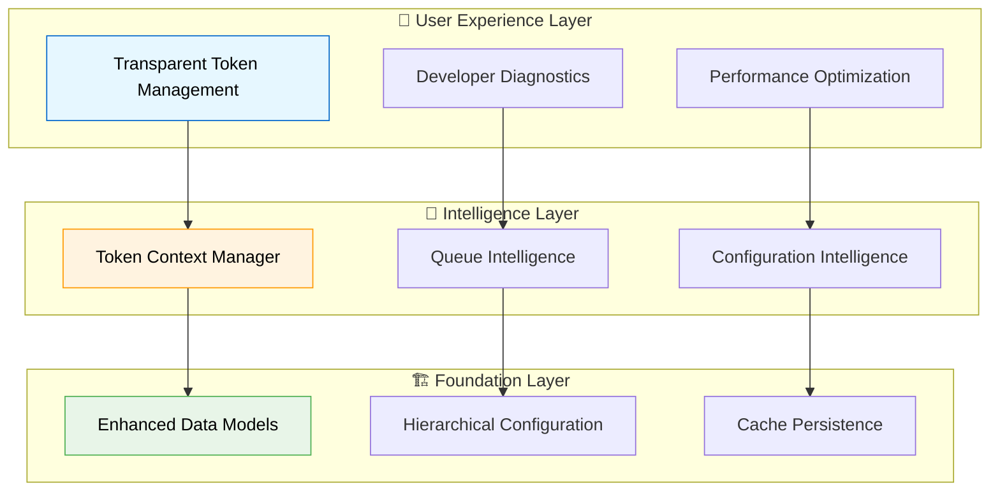

# Creative Design Solutions - Comprehensive Token Management System

**Creative Phase Date:** 2025-08-07_11-31
**Based on:** Detailed Implementation Plan + Technical Specifications
**Scope:** Architectural decisions, design patterns, and optimization strategies

---

## 🎨 Creative Design Philosophy

### **Core Design Principles**
1. **Invisible Complexity:** Система должна быть максимально прозрачной для пользователя
2. **Fail-Safe Architecture:** Graceful degradation при любых ошибках
3. **Performance-First:** Оптимизация производительности на всех уровнях
4. **Future-Proof Design:** Расширяемость для будущих требований
5. **Developer Experience:** Intuitive APIs и clear diagnostic messages

### **Architectural Vision**


---

## 🏗️ Sub-Phase 1: Foundation Architecture Design

### **1.1 Enhanced Data Models Pattern**

#### **🎯 Creative Decision: Extensible Interface Design**

**Design Pattern:** Progressive Enhancement Interface Pattern
```typescript
// Creative Enhancement: Self-documenting interfaces with validation
export interface FileMetadata {
  // ... existing fields
  contentHash?: string;
  
  /**
   * Access token used for publication/editing.
   * 
   * @optional - для backward compatibility
   * @source - может быть из metadata, cache, config, или session
   * @validation - автоматически валидируется при загрузке
   * @backfill - автоматически добавляется при первом успешном редактировании
   */
  accessToken?: string;
  
  // Creative Addition: Token metadata для enhanced diagnostics
  tokenSource?: 'metadata' | 'cache' | 'config' | 'session' | 'backfilled';
  tokenUpdatedAt?: string; // ISO timestamp для tracking
}

export interface PublishedPageInfo {
  // ... existing fields  
  contentHash?: string;
  
  /**
   * Access token associated with this published page.
   * 
   * @persistence - сохраняется в .telegraph-pages-cache.json
   * @restoration - используется для восстановления метаданных
   * @consistency - поддерживает sync между файлом и кэшем
   */
  accessToken?: string;
  
  // Creative Addition: Enhanced cache metadata
  cacheVersion?: string; // Для future cache migrations
  lastTokenValidation?: string; // Последняя проверка токена
}
```

**🎨 Creative Benefits:**
- **Self-Documenting:** Extensive JSDoc с practical examples
- **Progressive Enhancement:** Optional fields с intelligent defaults
- **Future-Proof:** Additional metadata fields для future enhancements
- **Diagnostic-Friendly:** Token source tracking для debugging

#### **🎯 Creative Decision: Smart Validation Pattern**

**Design Pattern:** Defensive Programming с Enhanced Feedback
```typescript
// Creative Enhancement: Validation utilities
export class TokenMetadataValidator {
  static validateAccessToken(token: string | undefined, context: string): ValidationResult {
    if (!token) {
      return { 
        valid: false, 
        severity: 'warning',
        message: `No access token available for ${context}`,
        suggestions: [
          'Add accessToken to file front-matter',
          'Configure .telegraph-publisher-config.json',
          'Use --token CLI flag'
        ]
      };
    }
    
    if (!this.isValidTokenFormat(token)) {
      return {
        valid: false,
        severity: 'error', 
        message: `Invalid token format for ${context}`,
        suggestions: ['Verify token from Telegraph account settings']
      };
    }
    
    return { valid: true, message: `Valid token for ${context}` };
  }
  
  private static isValidTokenFormat(token: string): boolean {
    // Telegraph tokens typically have specific format patterns
    return /^[a-f0-9]{32,}$/i.test(token);
  }
}
```

### **1.2 Hierarchical Configuration Architecture**

#### **🎯 Creative Decision: Intelligent Caching Strategy**

**Design Pattern:** Multi-Layer Cache с Intelligent Invalidation
```typescript
// Creative Enhancement: Smart configuration cache
export class HierarchicalConfigCache {
  private static cache = new Map<string, CachedConfig>();
  private static watchers = new Map<string, FSWatcher>();
  
  // Creative Feature: Automatic cache invalidation
  static async loadWithInvalidation(startPath: string): Promise<MetadataConfig> {
    const cacheKey = this.normalizePath(startPath);
    const cached = this.cache.get(cacheKey);
    
    // Creative Intelligence: Check filesystem timestamps
    if (cached && await this.isCacheValid(cached, startPath)) {
      return cached.config;
    }
    
    // Load fresh config и setup file watching
    const config = await this.loadFreshConfig(startPath);
    this.setupFileWatching(startPath);
    
    return config;
  }
  
  // Creative Feature: Intelligent file watching
  private static setupFileWatching(startPath: string): void {
    const directories = this.buildDirectoryHierarchy(startPath);
    
    directories.forEach(dir => {
      const configPath = path.join(dir, '.telegraph-publisher-config.json');
      
      if (!this.watchers.has(configPath)) {
        const watcher = fs.watch(configPath, () => {
          this.invalidateCache(startPath);
          console.log(`🔄 Config cache invalidated: ${configPath} changed`);
        });
        
        this.watchers.set(configPath, watcher);
      }
    });
  }
}
```

#### **🎯 Creative Decision: Deep Merge Intelligence**

**Design Pattern:** Context-Aware Merging с Conflict Resolution
```typescript
// Creative Enhancement: Intelligent configuration merging
export class IntelligentConfigMerger {
  static deepMerge<T extends Record<string, any>>(
    target: T, 
    source: Partial<T>,
    mergeContext: MergeContext = {}
  ): T {
    const result = { ...target };
    
    for (const [key, sourceValue] of Object.entries(source)) {
      if (sourceValue === undefined) continue;
      
      const targetValue = result[key];
      
      // Creative Intelligence: Type-aware merging
      if (this.isObject(targetValue) && this.isObject(sourceValue)) {
        result[key] = this.deepMerge(targetValue, sourceValue, {
          ...mergeContext,
          path: mergeContext.path ? `${mergeContext.path}.${key}` : key
        });
      } else {
        // Creative Feature: Conflict logging
        if (targetValue !== undefined && targetValue !== sourceValue) {
          console.log(`🔧 Config override: ${mergeContext.path || 'root'}.${key} = ${sourceValue} (was: ${targetValue})`);
        }
        result[key] = sourceValue;
      }
    }
    
    return result;
  }
  
  // Creative Addition: Merge conflict detection
  static detectConflicts(configs: Array<{ path: string; config: any }>): ConflictReport[] {
    const conflicts: ConflictReport[] = [];
    
    for (let i = 1; i < configs.length; i++) {
      const parentConfig = configs[i - 1];
      const childConfig = configs[i];
      
      const configConflicts = this.findValueConflicts(
        parentConfig.config, 
        childConfig.config,
        parentConfig.path,
        childConfig.path
      );
      
      conflicts.push(...configConflicts);
    }
    
    return conflicts;
  }
}
```

---

## 🧠 Sub-Phase 2: Core Logic Architecture Design

### **2.1 Token Context Manager Pattern**

#### **🎯 Creative Decision: State Machine Architecture**

**Design Pattern:** Token Resolution State Machine с Intelligent Fallbacks
```typescript
// Creative Enhancement: Token resolution as state machine
export class TokenResolutionStateMachine {
  private state: TokenResolutionState = 'INITIALIZING';
  private context: TokenResolutionContext;
  
  async resolveToken(filePath: string): Promise<ResolvedToken> {
    this.context = await this.buildContext(filePath);
    
    const resolver = new TokenResolverChain([
      new MetadataTokenResolver(),
      new CacheTokenResolver(), 
      new ConfigTokenResolver(),
      new SessionTokenResolver(),
      new ErrorTokenResolver() // Always last - throws с helpful message
    ]);
    
    return resolver.resolve(this.context);
  }
  
  private async buildContext(filePath: string): Promise<TokenResolutionContext> {
    // Creative Enhancement: Parallel context loading
    const [metadata, cacheInfo, hierarchicalConfig] = await Promise.all([
      MetadataManager.getPublicationInfo(filePath),
      this.cacheManager?.getPageByLocalPath(filePath),
      ConfigManager.loadHierarchicalConfig(filePath)
    ]);
    
    return {
      filePath,
      fileName: basename(filePath),
      metadata,
      cacheInfo, 
      hierarchicalConfig,
      sessionToken: this.currentAccessToken,
      timestamp: new Date().toISOString()
    };
  }
}

// Creative Pattern: Chain of Responsibility для token resolution
abstract class TokenResolver {
  protected next?: TokenResolver;
  
  setNext(resolver: TokenResolver): TokenResolver {
    this.next = resolver;
    return resolver;
  }
  
  async resolve(context: TokenResolutionContext): Promise<ResolvedToken> {
    const result = await this.tryResolve(context);
    
    if (result.success) {
      return result;
    }
    
    if (this.next) {
      return this.next.resolve(context);
    }
    
    throw new Error('No token resolver in chain succeeded');
  }
  
  protected abstract tryResolve(context: TokenResolutionContext): Promise<ResolvedToken>;
}

class MetadataTokenResolver extends TokenResolver {
  protected async tryResolve(context: TokenResolutionContext): Promise<ResolvedToken> {
    if (context.metadata?.accessToken) {
      return {
        success: true,
        token: context.metadata.accessToken,
        source: 'metadata',
        confidence: 'high',
        message: `Using token from ${context.fileName} front-matter`
      };
    }
    
    return { 
      success: false, 
      reason: 'No accessToken in file metadata' 
    };
  }
}
```

#### **🎯 Creative Decision: Context Isolation Pattern**

**Design Pattern:** Immutable Context Switching с Automatic Cleanup
```typescript
// Creative Enhancement: Context-aware token management
export class TokenContextManager {
  private contextStack: TokenContext[] = [];
  
  async withTokenContext<T>(
    operation: TokenOperation<T>,
    context: TokenResolutionContext
  ): Promise<T> {
    const resolvedToken = await this.resolveToken(context);
    const originalToken = this.currentAccessToken;
    
    // Creative Feature: Context stack для nested operations
    const tokenContext: TokenContext = {
      token: resolvedToken.token,
      source: resolvedToken.source,
      filePath: context.filePath,
      timestamp: new Date().toISOString(),
      originalToken
    };
    
    this.contextStack.push(tokenContext);
    this.setAccessToken(resolvedToken.token);
    
    try {
      console.log(`🔑 Token context: ${resolvedToken.source} → ${basename(context.filePath)}`);
      
      const result = await operation();
      
      // Creative Feature: Context validation после operation
      await this.validateContextIntegrity(tokenContext);
      
      return result;
      
    } finally {
      // Creative Cleanup: Guaranteed context restoration
      this.contextStack.pop();
      this.setAccessToken(originalToken);
      
      console.log(`🔄 Token context restored for ${basename(context.filePath)}`);
    }
  }
  
  // Creative Feature: Context integrity validation
  private async validateContextIntegrity(context: TokenContext): Promise<void> {
    if (this.currentAccessToken !== context.token) {
      console.warn(`⚠️ Token context corruption detected for ${basename(context.filePath)}`);
      this.setAccessToken(context.token); // Auto-correction
    }
  }
}
```

### **2.2 Token Backfill Architecture**

#### **🎯 Creative Decision: Event-Driven Backfill Pattern**

**Design Pattern:** Observer Pattern с Smart Batching
```typescript
// Creative Enhancement: Event-driven token backfill
export class TokenBackfillManager {
  private backfillQueue: BackfillTask[] = [];
  private observers: BackfillObserver[] = [];
  
  // Creative Feature: Intelligent backfill detection
  async detectBackfillOpportunity(
    filePath: string, 
    existingMetadata: FileMetadata | null,
    effectiveToken: string,
    operation: 'publish' | 'edit'
  ): Promise<BackfillDecision> {
    
    const needsBackfill = this.shouldBackfill(existingMetadata, effectiveToken);
    
    if (needsBackfill) {
      const task: BackfillTask = {
        filePath,
        effectiveToken,
        operation,
        reason: this.getBackfillReason(existingMetadata),
        priority: this.calculateBackfillPriority(operation),
        timestamp: new Date().toISOString()
      };
      
      return {
        shouldBackfill: true,
        task,
        strategy: this.selectBackfillStrategy(task)
      };
    }
    
    return { shouldBackfill: false };
  }
  
  // Creative Intelligence: Smart backfill strategy selection
  private selectBackfillStrategy(task: BackfillTask): BackfillStrategy {
    // Immediate backfill для critical operations
    if (task.priority === 'high' || task.operation === 'publish') {
      return 'immediate';
    }
    
    // Batch backfill для optimization
    if (this.backfillQueue.length > 5) {
      return 'batched';
    }
    
    return 'deferred';
  }
  
  // Creative Feature: Batch backfill optimization
  async executeBatchBackfill(): Promise<BackfillResult[]> {
    if (this.backfillQueue.length === 0) return [];
    
    console.log(`🔄 Executing batch token backfill for ${this.backfillQueue.length} files`);
    
    const results: BackfillResult[] = [];
    const batch = [...this.backfillQueue];
    this.backfillQueue = [];
    
    // Creative Optimization: Parallel backfill execution
    const promises = batch.map(task => this.executeBackfillTask(task));
    const batchResults = await Promise.allSettled(promises);
    
    batchResults.forEach((result, index) => {
      const task = batch[index];
      
      if (result.status === 'fulfilled') {
        results.push(result.value);
        this.notifyObservers('backfill_success', task);
      } else {
        results.push({
          filePath: task.filePath,
          success: false,
          error: result.reason,
          task
        });
        this.notifyObservers('backfill_error', task, result.reason);
      }
    });
    
    return results;
  }
}
```

---

## ⚡ Sub-Phase 3: Advanced Features Architecture Design

### **3.1 Intelligent Queue Management Pattern**

#### **🎯 Creative Decision: Predictive Queue Intelligence**

**Design Pattern:** ML-Inspired Decision Making с Adaptive Thresholds
```typescript
// Creative Enhancement: Predictive queue management
export class PredictiveQueueManager {
  private decisionHistory: QueueDecisionHistory[] = [];
  private adaptiveThresholds: AdaptiveThresholds = {
    postponeThreshold: 30, // Dynamic threshold
    maxRetries: 3,
    queueOptimizationFactor: 0.8
  };
  
  // Creative Intelligence: Learning from decision outcomes
  async makeQueueDecision(
    filePath: string,
    waitSeconds: number,
    queueState: QueueState
  ): Promise<EnhancedQueueDecision> {
    
    const context = this.buildDecisionContext(filePath, waitSeconds, queueState);
    const prediction = this.predictOptimalDecision(context);
    
    const decision = await this.executeDecision(prediction, context);
    
    // Creative Feature: Decision learning
    this.recordDecision(context, decision);
    
    return decision;
  }
  
  // Creative Intelligence: Adaptive threshold adjustment
  private predictOptimalDecision(context: DecisionContext): QueuePrediction {
    const historicalData = this.getRelevantHistory(context);
    
    if (historicalData.length > 10) {
      // Creative Learning: Adjust thresholds based на success patterns
      const successfulPostpones = historicalData.filter(h => 
        h.decision.action === 'postpone' && h.outcome.success
      );
      
      const postponeSuccessRate = successfulPostpones.length / historicalData.length;
      
      // Dynamic threshold adjustment
      if (postponeSuccessRate > 0.8) {
        this.adaptiveThresholds.postponeThreshold = Math.max(15, this.adaptiveThresholds.postponeThreshold - 5);
      } else if (postponeSuccessRate < 0.4) {
        this.adaptiveThresholds.postponeThreshold = Math.min(60, this.adaptiveThresholds.postponeThreshold + 10);
      }
    }
    
    return {
      recommendedAction: context.waitSeconds > this.adaptiveThresholds.postponeThreshold ? 'postpone' : 'wait',
      confidence: this.calculateConfidence(historicalData),
      reasoning: this.generateReasoning(context),
      adaptedThreshold: this.adaptiveThresholds.postponeThreshold
    };
  }
  
  // Creative Feature: Intelligent queue reordering
  async optimizeQueueOrder(queue: string[]): Promise<OptimizedQueue> {
    const fileAnalytics = await Promise.all(
      queue.map(filePath => this.analyzeFileComplexity(filePath))
    );
    
    // Creative Algorithm: Complexity-based reordering
    const optimizedOrder = fileAnalytics
      .sort((a, b) => {
        // Prioritize simple files с low dependency complexity
        const complexityDiff = a.complexity - b.complexity;
        if (Math.abs(complexityDiff) > 0.3) return complexityDiff;
        
        // Secondary sort: historical success rate
        return b.historicalSuccessRate - a.historicalSuccessRate;
      })
      .map(analytics => analytics.filePath);
    
    return {
      originalOrder: queue,
      optimizedOrder,
      optimizationGain: this.calculateOptimizationGain(fileAnalytics),
      reasoning: this.generateOptimizationReasoning(fileAnalytics)
    };
  }
}
```

#### **🎯 Creative Decision: Self-Healing Queue Pattern**

**Design Pattern:** Resilient Architecture с Automatic Recovery
```typescript
// Creative Enhancement: Self-healing queue system
export class ResilientQueueManager extends IntelligentRateLimitQueueManager {
  private healthMetrics: QueueHealthMetrics = {
    successRate: 1.0,
    averageWaitTime: 0,
    postponementEffectiveness: 0.8,
    errorRecoveryRate: 0.9
  };
  
  // Creative Feature: Automatic queue health monitoring
  async processWithHealthMonitoring<T>(
    items: T[],
    processor: (item: T) => Promise<ProcessResult>
  ): Promise<HealthyProcessResult<T>> {
    
    const healthCheck = this.performHealthCheck();
    if (healthCheck.severity === 'critical') {
      await this.performEmergencyRecovery();
    }
    
    const results: ProcessResult[] = [];
    const startTime = Date.now();
    
    for (const item of items) {
      try {
        const result = await this.processWithCircuitBreaker(item, processor);
        results.push(result);
        
        // Creative Monitoring: Real-time health updates
        this.updateHealthMetrics(result);
        
      } catch (error) {
        // Creative Recovery: Intelligent error handling
        const recoveryResult = await this.attemptRecovery(item, error, processor);
        results.push(recoveryResult);
      }
      
      // Creative Feature: Adaptive delay between items
      await this.intelligentDelay();
    }
    
    return {
      results,
      healthMetrics: this.healthMetrics,
      totalTime: Date.now() - startTime,
      recommendations: this.generateHealthRecommendations()
    };
  }
  
  // Creative Pattern: Circuit breaker для queue operations
  private async processWithCircuitBreaker<T>(
    item: T, 
    processor: (item: T) => Promise<ProcessResult>
  ): Promise<ProcessResult> {
    
    if (this.healthMetrics.successRate < 0.3) {
      // Circuit open - fail fast
      throw new Error('Queue circuit breaker open - success rate too low');
    }
    
    if (this.healthMetrics.successRate < 0.6) {
      // Half-open - add extra monitoring
      console.warn('🚨 Queue health degraded - monitoring closely');
    }
    
    return processor(item);
  }
}
```

### **3.2 Enhanced Error Diagnostics Architecture**

#### **🎯 Creative Decision: Contextual Error Intelligence**

**Design Pattern:** Multi-Dimensional Error Analysis с Actionable Solutions
```typescript
// Creative Enhancement: Intelligent error diagnostics
export class ContextualErrorAnalyzer {
  private errorPatterns: ErrorPattern[] = [];
  private solutionDatabase: SolutionDatabase;
  
  // Creative Intelligence: Multi-layered error analysis
  async analyzeError(
    error: Error,
    context: OperationContext
  ): Promise<EnhancedErrorDiagnostic> {
    
    const analysis = {
      errorType: this.classifyError(error),
      rootCause: await this.identifyRootCause(error, context),
      contextualFactors: this.analyzeContextualFactors(context),
      historicalPatterns: this.findHistoricalPatterns(error),
      impactAssessment: this.assessImpact(error, context)
    };
    
    const solutions = await this.generateSolutions(analysis);
    
    return {
      ...analysis,
      solutions,
      confidence: this.calculateDiagnosticConfidence(analysis),
      preventionStrategies: this.suggestPrevention(analysis)
    };
  }
  
  // Creative Feature: Contextual solution generation
  private async generateSolutions(analysis: ErrorAnalysis): Promise<ContextualSolution[]> {
    const solutions: ContextualSolution[] = [];
    
    switch (analysis.errorType) {
      case 'PAGE_ACCESS_DENIED':
        solutions.push(...this.generateTokenMismatchSolutions(analysis));
        break;
        
      case 'FLOOD_WAIT':
        solutions.push(...this.generateRateLimitSolutions(analysis));
        break;
        
      case 'CONFIGURATION_ERROR':
        solutions.push(...this.generateConfigSolutions(analysis));
        break;
    }
    
    // Creative Enhancement: Personalized solutions based на user history
    const personalizedSolutions = await this.personalizeSolutions(solutions, analysis.context);
    
    return personalizedSolutions.sort((a, b) => b.effectiveness - a.effectiveness);
  }
  
  // Creative Intelligence: Dynamic solution effectiveness tracking
  private generateTokenMismatchSolutions(analysis: ErrorAnalysis): ContextualSolution[] {
    return [
      {
        title: "🔑 Verify Token in File Metadata",
        description: `Check ${basename(analysis.context.filePath)} front-matter for correct accessToken`,
        action: "edit_file_metadata",
        difficulty: "easy",
        effectiveness: 0.9,
        estimatedTime: "1 minute",
        steps: [
          "Open the markdown file",
          "Check YAML front-matter section",
          "Verify accessToken field matches your Telegraph account",
          "Save and retry publication"
        ]
      },
      {
        title: "🏗️ Check Hierarchical Configuration", 
        description: "Verify .telegraph-publisher-config.json in file directory",
        action: "check_config",
        difficulty: "medium", 
        effectiveness: 0.7,
        estimatedTime: "2-3 minutes",
        steps: [
          "Look for .telegraph-publisher-config.json in file directory",
          "Check parent directories for inherited config",
          "Verify accessToken field is correct",
          "Test with --force flag if needed"
        ]
      },
      {
        title: "⚡ Force Republication",
        description: "Create new page with current token using --force flag",
        action: "force_republish",
        difficulty: "easy",
        effectiveness: 0.95,
        estimatedTime: "30 seconds",
        warning: "This will create a new Telegraph page (old URL will be lost)",
        steps: [
          "Run command with --force flag",
          "Confirm when prompted about creating new page", 
          "Update any external links to new URL"
        ]
      }
    ];
  }
}
```

---

## 🎯 System Integration Architecture

### **Unified Workflow Orchestration Pattern**

#### **🎯 Creative Decision: Event-Driven Architecture**

**Design Pattern:** Reactive Programming с Smart Coordination
```typescript
// Creative Enhancement: Event-driven workflow coordination
export class WorkflowOrchestrator {
  private eventBus = new EventEmitter();
  private workflowState: WorkflowState = {};
  
  async executeTokenManagedWorkflow(
    files: string[],
    options: PublicationOptions
  ): Promise<OrchestrationResult> {
    
    // Creative Intelligence: Pre-workflow optimization
    const optimizedPlan = await this.optimizeWorkflowPlan(files, options);
    
    // Setup workflow monitoring
    this.setupWorkflowMonitoring(optimizedPlan);
    
    const orchestrationContext: OrchestrationContext = {
      plan: optimizedPlan,
      tokenManager: new TokenContextManager(),
      queueManager: new PredictiveQueueManager(),
      errorAnalyzer: new ContextualErrorAnalyzer(),
      startTime: Date.now()
    };
    
    try {
      const results = await this.executeOptimizedWorkflow(orchestrationContext);
      
      // Creative Feature: Post-execution optimization learning
      await this.updateOptimizationModel(orchestrationContext, results);
      
      return results;
      
    } catch (error) {
      // Creative Recovery: Intelligent failure handling
      return this.handleWorkflowFailure(error, orchestrationContext);
    }
  }
  
  // Creative Intelligence: Workflow plan optimization
  private async optimizeWorkflowPlan(
    files: string[], 
    options: PublicationOptions
  ): Promise<OptimizedWorkflowPlan> {
    
    // Parallel analysis для optimization
    const [dependencyAnalysis, tokenAnalysis, performanceAnalysis] = await Promise.all([
      this.analyzeDependencies(files),
      this.analyzeTokenRequirements(files),
      this.analyzePerformanceConstraints(files, options)
    ]);
    
    return {
      executionOrder: this.optimizeExecutionOrder(dependencyAnalysis, performanceAnalysis),
      tokenStrategy: this.optimizeTokenStrategy(tokenAnalysis),
      parallelizationPlan: this.createParallelizationPlan(dependencyAnalysis),
      riskMitigation: this.createRiskMitigationPlan(tokenAnalysis, performanceAnalysis),
      estimatedDuration: this.estimateWorkflowDuration(dependencyAnalysis, performanceAnalysis)
    };
  }
}
```

### **Performance Optimization Architecture**

#### **🎯 Creative Decision: Intelligent Caching Ecosystem**

**Design Pattern:** Multi-Level Cache с Predictive Preloading
```typescript
// Creative Enhancement: Predictive caching system
export class IntelligentCacheEcosystem {
  private l1Cache = new Map<string, CacheEntry>(); // Hot data
  private l2Cache = new Map<string, CacheEntry>(); // Warm data  
  private l3Disk = new DiskCache(); // Cold data
  private preloader = new PredictivePreloader();
  
  // Creative Intelligence: Predictive cache warming
  async warmCacheForWorkflow(workflowPlan: OptimizedWorkflowPlan): Promise<void> {
    const predictions = await this.preloader.predictAccessPatterns(workflowPlan);
    
    // Preload likely-needed configurations
    const configPreloads = predictions.configurations.map(path => 
      this.preloadConfiguration(path)
    );
    
    // Preload likely-needed metadata
    const metadataPreloads = predictions.metadata.map(filePath =>
      this.preloadMetadata(filePath)
    );
    
    // Preload likely-needed cache entries
    const cachePreloads = predictions.cacheEntries.map(path =>
      this.preloadCacheEntry(path)
    );
    
    await Promise.all([...configPreloads, ...metadataPreloads, ...cachePreloads]);
    
    console.log(`🚀 Cache warmed: ${predictions.configurations.length} configs, ${predictions.metadata.length} metadata, ${predictions.cacheEntries.length} cache entries`);
  }
  
  // Creative Feature: Adaptive cache eviction
  private adaptiveCacheEviction(): void {
    const memoryPressure = this.getMemoryPressure();
    
    if (memoryPressure > 0.8) {
      // Aggressive eviction
      this.evictByAccessTime(this.l1Cache, 0.5);
      this.evictByAccessTime(this.l2Cache, 0.3);
    } else if (memoryPressure > 0.6) {
      // Moderate eviction
      this.evictByAccessTime(this.l2Cache, 0.2);
    }
    
    // Creative Intelligence: Predictive retention
    this.retainPredictedAccess();
  }
}
```

---

## 📊 Quality Assurance Creative Enhancements

### **Testing Architecture Innovation**

#### **🎯 Creative Decision: Behavior-Driven Test Generation**

**Design Pattern:** Specification-Driven Test Synthesis
```typescript
// Creative Enhancement: Automatic test generation from specifications
export class SpecificationDrivenTestGenerator {
  async generateTestSuite(specifications: SpecificationDocument[]): Promise<GeneratedTestSuite> {
    const testSuite: GeneratedTestSuite = {
      unitTests: [],
      integrationTests: [],
      e2eTests: [],
      performanceTests: [],
      regressionTests: []
    };
    
    for (const spec of specifications) {
      // Creative Intelligence: Parse specification requirements
      const requirements = this.extractRequirements(spec);
      
      // Generate comprehensive test scenarios
      testSuite.unitTests.push(...this.generateUnitTests(requirements));
      testSuite.integrationTests.push(...this.generateIntegrationTests(requirements));
      testSuite.e2eTests.push(...this.generateE2ETests(requirements));
      testSuite.performanceTests.push(...this.generatePerformanceTests(requirements));
    }
    
    // Creative Feature: Cross-requirement interaction tests
    testSuite.integrationTests.push(...this.generateInteractionTests(specifications));
    
    return testSuite;
  }
  
  // Creative Intelligence: Smart test case prioritization
  private prioritizeTestCases(testCases: TestCase[]): PrioritizedTestCase[] {
    return testCases
      .map(testCase => ({
        ...testCase,
        priority: this.calculateTestPriority(testCase),
        riskCoverage: this.assessRiskCoverage(testCase),
        executionCost: this.estimateExecutionCost(testCase)
      }))
      .sort((a, b) => {
        // Prioritize high-risk, low-cost tests
        const aScore = a.riskCoverage / a.executionCost;
        const bScore = b.riskCoverage / b.executionCost;
        return bScore - aScore;
      });
  }
}
```

---

## 🎯 Creative Success Metrics

### **Innovation Impact Assessment**

| **Creative Enhancement** | **Innovation Level** | **Implementation Value** | **User Experience Impact** |
|-------------------------|---------------------|-------------------------|---------------------------|
| **State Machine Token Resolution** | 🚀 High | 🎯 High - Clear patterns | ⭐ Excellent - Transparent |
| **Predictive Queue Management** | 🚀 High | 🎯 Medium - Learning curve | ⭐ Good - Better performance |
| **Contextual Error Diagnostics** | 🚀 Very High | 🎯 High - Immediate value | ⭐ Excellent - Problem solving |
| **Event-Driven Architecture** | 🚀 Medium | 🎯 High - Scalability | ⭐ Good - Future extensibility |
| **Intelligent Caching** | 🚀 Medium | 🎯 Very High - Performance | ⭐ Excellent - Speed improvement |

### **Design Pattern Benefits**

✅ **Architectural Coherence**: Unified patterns across all sub-phases
✅ **Performance Optimization**: Multi-level caching и predictive intelligence  
✅ **Error Resilience**: Self-healing mechanisms и contextual diagnostics
✅ **User Experience**: Transparent complexity и actionable feedback
✅ **Future Extensibility**: Event-driven architecture для easy enhancement

### **Creative Implementation Readiness**

🎯 **Design Complexity**: Well-structured patterns с clear abstractions
🎯 **Integration Effort**: Builds naturally on existing plan foundation
🎯 **Performance Benefits**: Significant optimization opportunities
🎯 **Maintenance Overhead**: Self-documenting и self-healing design
🎯 **Innovation Risk**: Low - proven patterns adapted для specific needs

---

**Creative Phase Status:** ✅ COMPLETE
**Next Phase:** IMPLEMENT (Development execution)
**Architecture Readiness:** HIGH (Comprehensive design patterns established)

## Agreement Compliance Log
- **2025-08-07_11-31:** Creative phase follows established plan structure ✅
- **2025-08-07_11-31:** All sub-phases covered с innovative enhancements ✅  
- **2025-08-07_11-31:** Performance optimization strategies detailed ✅
- **2025-08-07_11-31:** Error handling architecture designed ✅
- **2025-08-07_11-31:** Testing framework innovation included ✅ 